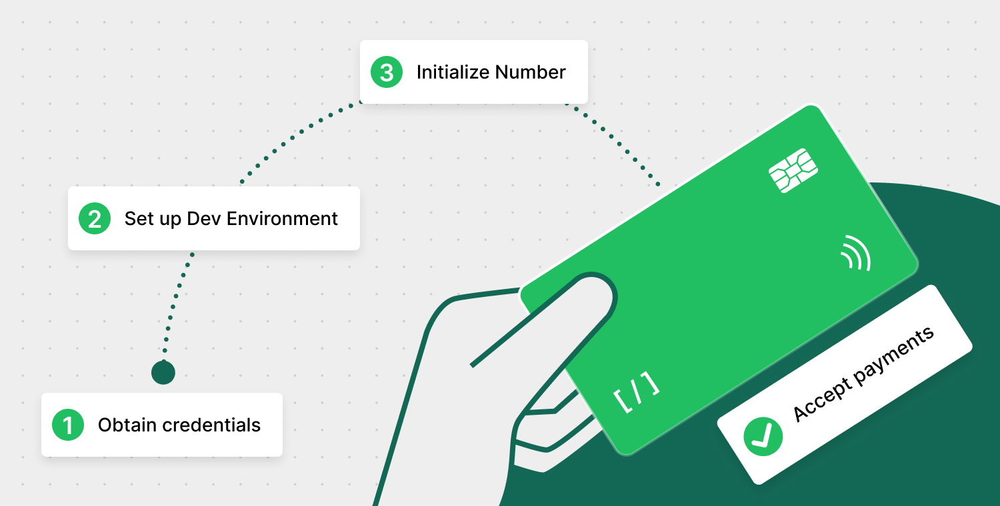

# Home

The number is dedicated to delivering reliable and responsive payment services that meet the high expectations of today's businesses and their customers. Our system is built with:

* Robust infrastructure to ensure uninterrupted service.
* Streamlined processes to ensure smooth and efficient transactions at all times.

<figure><figcaption></figcaption></figure>

We understand the critical nature of payment processing and are committed to maintaining seamless operations. Furthermore, our dedicated support team is available around the clock to provide immediate assistance and resolve any issues, ensuring your business can operate without disruption.


[customer-support](help/customer-support/)


***

### AI assistant

Talk to our AI assistant. They are available 24/7 and will be happy to answer any questions you may have about Number integration.

<mark style="color:blue;">Ask AI Now</mark>&#x20;

<figure><figcaption></figcaption></figure>

***

### Ease of integration

Number prioritizes straightforward and efficient integration, [check the full launch guideline](documentation/getting-started/integration-options-v1/) and integration checklist:

<table data-card-size="large" data-view="cards"><thead><tr><th></th><th data-hidden data-card-cover data-type="files"></th><th data-hidden data-card-target data-type="content-ref"></th></tr></thead><tbody><tr><td><strong>Getting Started</strong></td><td><a href=".gitbook/assets/1 Getting started.png">1 Getting started.png</a></td><td><a href="documentation/getting-started/">getting-started</a></td></tr><tr><td><strong>Integration Checklist</strong></td><td><a href=".gitbook/assets/2 Integration Checklist.png">2 Integration Checklist.png</a></td><td><a href="documentation/getting-started/integration-checklist.md">integration-checklist.md</a></td></tr></tbody></table>

### Integrate Number

Use our Mobile SDKs and API Reference to integrate a Number service into your system or application.

<table data-view="cards"><thead><tr><th></th><th data-hidden data-card-cover data-type="files"></th><th data-hidden data-card-target data-type="content-ref"></th></tr></thead><tbody><tr><td><strong>API Reference</strong></td><td><a href=".gitbook/assets/API Reference (1).png">API Reference (1).png</a></td><td><a href="broken-reference">Broken link</a></td></tr><tr><td> <strong>iOS Mobile SDK</strong></td><td><a href=".gitbook/assets/Mobile SDK iOS (1).png">Mobile SDK iOS (1).png</a></td><td><a href="documentation/getting-started/integration-options-v1/ios-sdk-v1.md">ios-sdk-v1.md</a></td></tr><tr><td><strong>Android Mobile SDK</strong></td><td><a href=".gitbook/assets/Mobile SDK Android (1).png">Mobile SDK Android (1).png</a></td><td><a href="documentation/getting-started/integration-options-v1/android-sdk-v2.md">android-sdk-v2.md</a></td></tr><tr><td><strong>WIN SDK (Dynamic Link Libraries (DLL))</strong></td><td><a href=".gitbook/assets/WIN SDK.png">WIN SDK.png</a></td><td><a href="documentation/getting-started/integration-options-v1/dynamic-link-libraries.md">dynamic-link-libraries.md</a></td></tr></tbody></table>

***

### Services

Our comprehensive range of services is designed to meet various needs, ensuring users can find tailored solutions for every requirement.

<table data-view="cards"><thead><tr><th></th><th data-hidden data-card-target data-type="content-ref"></th></tr></thead><tbody><tr><td><strong>REST API</strong></td><td><a href="documentation/getting-started/integration-options-v1/rest-api-v1.md">rest-api-v1.md</a></td></tr><tr><td><strong>SOAP API</strong></td><td><a href="documentation/getting-started/integration-options-v1/soap-api-v1.md">soap-api-v1.md</a></td></tr><tr><td> <strong>iOS Mobile SDK</strong></td><td><a href="documentation/getting-started/integration-options-v1/ios-sdk-v1.md">ios-sdk-v1.md</a></td></tr><tr><td><strong>Android Mobile SDK</strong></td><td><a href="documentation/getting-started/integration-options-v1/android-sdk-v2.md">android-sdk-v2.md</a></td></tr><tr><td><strong>PayForm</strong></td><td><a href="documentation/getting-started/integration-options-v1/payform-v1.md">payform-v1.md</a></td></tr><tr><td><strong>Virtual Terminal</strong></td><td><a href="documentation/getting-started/integration-options-v1/virtual-terminal.md">virtual-terminal.md</a></td></tr><tr><td><strong>Desktop Applications</strong></td><td><a href="documentation/getting-started/integration-options-v1/custom-desktop-application.md">custom-desktop-application.md</a></td></tr><tr><td><strong>WIN SDK (Dynamic Link Libraries (DLL))</strong></td><td><a href="documentation/getting-started/integration-options-v1/dynamic-link-libraries.md">dynamic-link-libraries.md</a></td></tr><tr><td><strong>Win Services</strong></td><td></td></tr><tr><td><strong>Text2Pay</strong></td><td></td></tr></tbody></table>


[Learn more](home/services-and-supported-features-wip.md) about services and payment methods


***

### Supported features

Explore our diverse payment methods for a seamless experience:

<table data-view="cards"><thead><tr><th></th><th data-hidden data-card-cover data-type="files"></th><th data-hidden data-card-target data-type="content-ref"></th></tr></thead><tbody><tr><td><strong>Online payments</strong></td><td><a href=".gitbook/assets/1 Online payments.png">1 Online payments.png</a></td><td></td></tr><tr><td><strong>Card present payments</strong></td><td><a href=".gitbook/assets/2 Card present.png">2 Card present.png</a></td><td><a href="documentation/card-present-payments.md">card-present-payments.md</a></td></tr><tr><td><strong>Store card on file</strong></td><td><a href=".gitbook/assets/3 Store card on file.png">3 Store card on file.png</a></td><td><a href="documentation/store-card-on-file.md">store-card-on-file.md</a></td></tr><tr><td><strong>Surcharge payments</strong></td><td><a href=".gitbook/assets/4 Surcharge payments.png">4 Surcharge payments.png</a></td><td><a href="documentation/surcharge-payments.md">surcharge-payments.md</a></td></tr><tr><td><strong>Recurring payments</strong></td><td><a href=".gitbook/assets/5 Recurring payments.png">5 Recurring payments.png</a></td><td></td></tr><tr><td><strong>Authorizing payments</strong></td><td><a href=".gitbook/assets/6 Authorizing payments.png">6 Authorizing payments.png</a></td><td></td></tr><tr><td><strong>Voiding</strong></td><td><a href=".gitbook/assets/7 Voiding.png">7 Voiding.png</a></td><td></td></tr><tr><td><strong>Crediting (Refunds)</strong></td><td><a href=".gitbook/assets/8 Crediting (Refunds).png">8 Crediting (Refunds).png</a></td><td></td></tr><tr><td><strong>Settlements</strong></td><td><a href=".gitbook/assets/9 Settlements.png">9 Settlements.png</a></td><td></td></tr><tr><td><strong>Reporting</strong></td><td><a href=".gitbook/assets/10 Reporting.png">10 Reporting.png</a></td><td></td></tr><tr><td><strong>Manually keyed transactions</strong></td><td><a href=".gitbook/assets/Manually keyed transactions.png">Manually keyed transactions.png</a></td><td></td></tr></tbody></table>

***

### Get your business started

Adoption is crucial for maximizing the benefits of any payment solution, and Number is designed with this in mind. Our platform emphasizes easy user adoption and streamlined customer onboarding, ensuring a smooth transition for both end-users and merchants.
