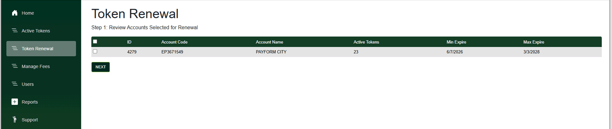
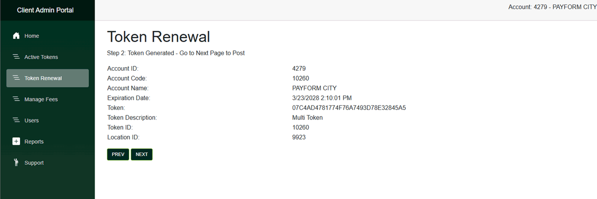
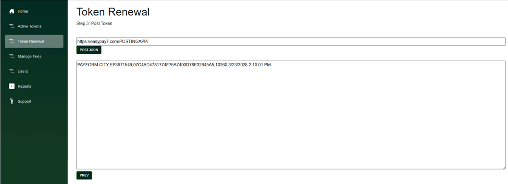
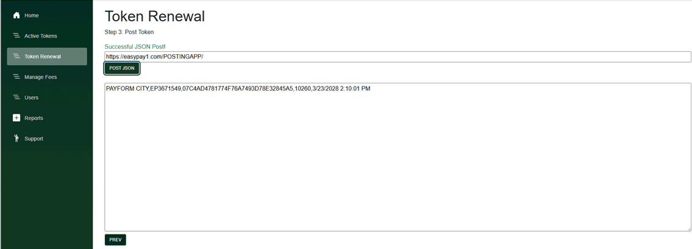
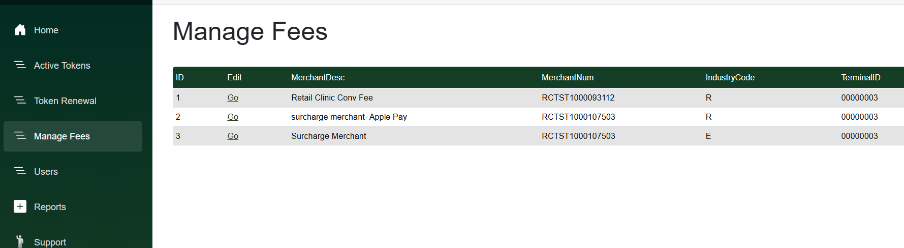
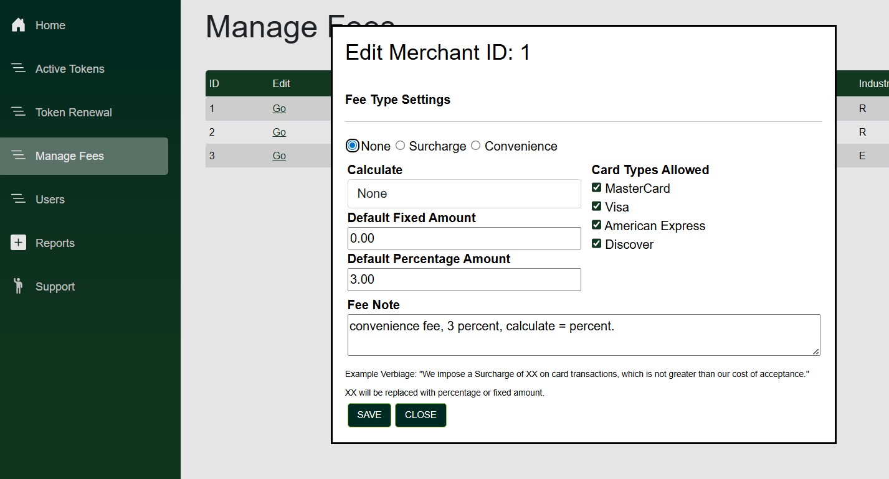
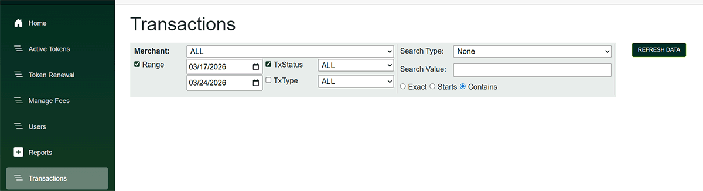
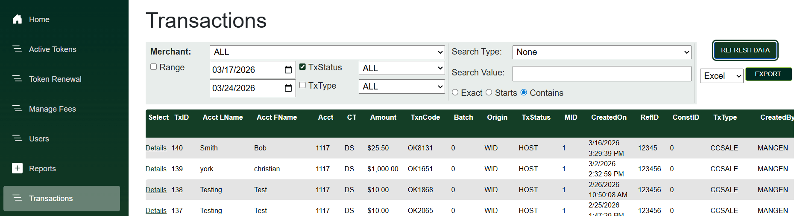
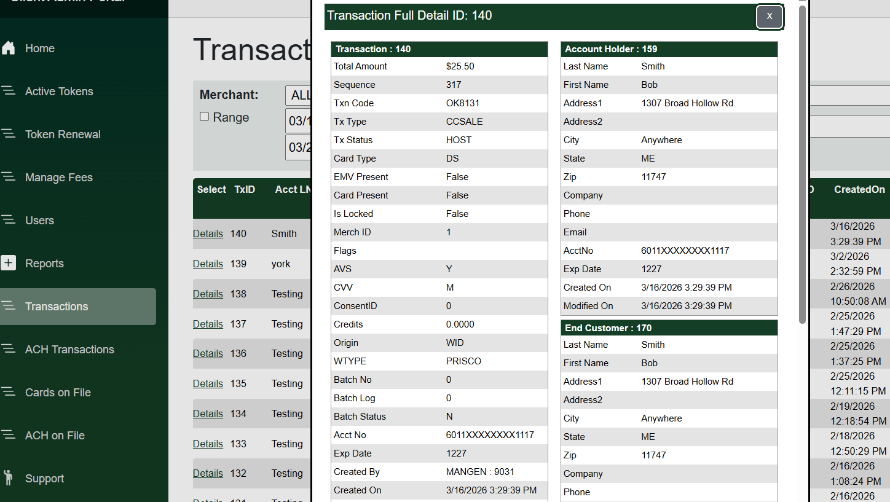

# Client Admin Portal

The Client Admin Portal allows you to do Admin Tasks such as:

* Create/Modify Virtual Terminal Users&#x20;
* Create/Inspect API Tokens&#x20;
* View Transaction Details
* View Card On File Details

#### Client Admin Portal Modes of Operation

**Merchant/Single Account Admin**

This type of access is provided if you are responsible for a single account. You have unlimited access to create Users and API Tokens. You have full access to all reports. &#x20;

***

**Integrator / Multi Account Admin**

This type of access is granted to Integrators who must process transactions for multiple accounts. You can Create API Tokens , but NOT Virtual Terminal Users. You have Read-Only access to reports.

## Single Sign-On (SSO)

Single Sign-On (SSO) is integrated between the Client Admin Portal and the Virtual Terminal (VT). Client admin credentials allow users to log in to the Virtual Terminal without needing a separate set of VT credentials.

When you receive your client admin credentials, it is recommended that you log in to the Client Admin Portal and change your temporary password to a permanent one. After the one-time password has been changed, the same credentials can be used to access the Virtual Terminal.&#x20;


Note: SSO is only available for single-account logins and is not supported for multi-user integrator accounts.&#x20;


## Integrator token renewal


API tokens are automatically renewed if both of the following conditions are met:

1. The credentials have been successfully authenticated within the last month.
2. The token is set to expire within the next month and has not yet expired.


Once you log in, you'll see a menu on the left with a _Token Renewal_ heading.

The Token Renewal function allows you to select the accounts for which to issue new tokens. It also provides a summary including the total number of active tokens assigned to each account. Select the account(s) you wish to renew, then click Next.

<figure><figcaption></figcaption></figure>

After selecting the accounts you wish to renew, you will see a summary with new token information. At this point you can either copy the new token or proceed to the next step for automated processing at your url.

<figure><figcaption></figcaption></figure>

### Posting the token JSON data to your webhook URL

<figure><figcaption></figcaption></figure>

We will create a JSON array named _TOKENS_ and send it directly to the URL you specify. You can obtain this data by accessing the InputStream at your server endpoint.

When you select `POST JSON`, we will create a JSON array named _TOKENS_ and send it directly to the URL you specify. You can obtain this data by accessing the InputStream at your server endpoint.



```csharp
string json;
using (var reader = new StreamReader(Request.InputStream))
{
    json = reader.ReadToEnd();
}
```




```json
"Tokens": [{"TokenID":"8961", "AccountCode":"EP8179234", "Token":"AB87E1D81559466E9165FCDA2B5B12C3", "AccountName":"CY FD TEST", "ExpirationDate":"11/22/2026 1:59:54 PM"}, {"TokenID":"8962", "AccountCode":"EP1519128", "Token":"EDB6D3FC1DE44A5C883BC718350C40BC", "AccountName":"CY TSYS TEST", "ExpirationDate":"11/22/2026 1:59:54 PM"}]
```


<figure><figcaption></figcaption></figure>

## Manage Fees

To manage a Merchant's Fees, click on the _Manage Fees_ link. Acknowledge the Disclaimer to view the list of Merchants.

<figure><figcaption></figcaption></figure>

Click the go link next to a respective merchant to get to the edit screen, where you can edit fee type, rate, cards allowed and notations.

<figure><figcaption></figcaption></figure>

## Reports

(Transactions, ACH Transactions, Cards on File, ACH on File)

Once you log in, you'll see a menu on the left with a _Reports_ heading. Expand this to see all the subheadings. All pages in this section function the same way.

<figure><figcaption></figcaption></figure>

These pages allow you to filter all transactions (or COF) by date, txstatus,txtype and search by various field types. After adjusting your criteria, press the _Refresh Data_ button to see the applicable reports.

<figure><figcaption></figcaption></figure>

After finding the transaction or COF desired, you can click on the _Details_ link to see the in depth information.

<figure><figcaption></figcaption></figure>
