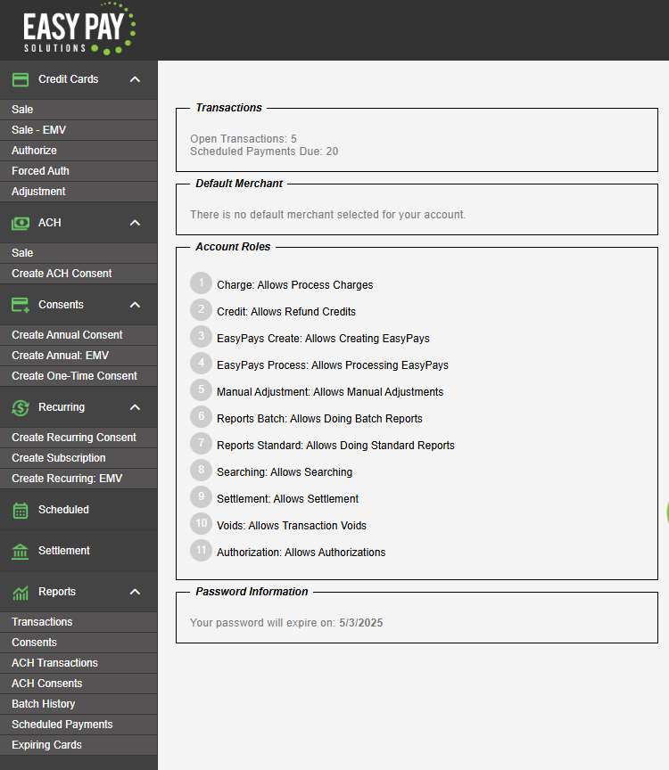
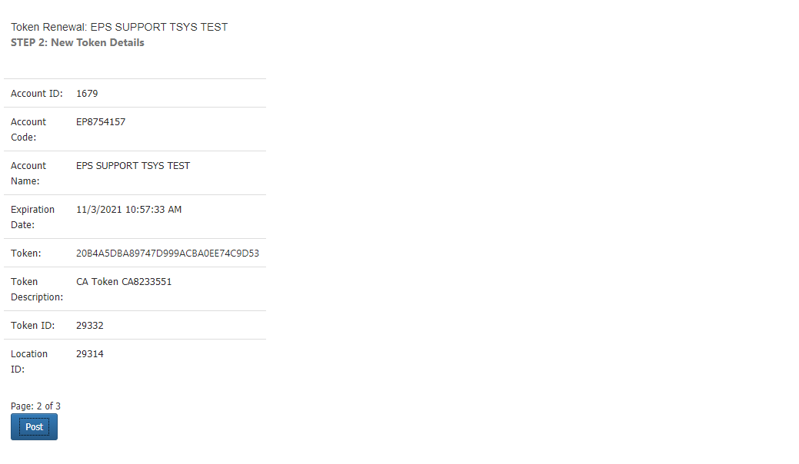
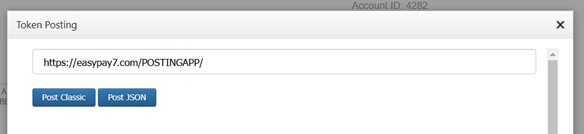

# Client Admin Portal (v1)

The Client Admin Portal gives the means to create, modify, and remove Virtual Terminal users, create new API tokens, and inspect active or expiring tokens.


***


## Accessing the portal

To get access to the portal and create new accounts, contact the [Number support team](../../help/customer-support/).&#x20;

You will be asked to provide the full name, e-mail address, and cell phone number for every individual you wish to have access to the portal. Each one of them will receive a text message containing their username and an e-mail containing their password with the URL of the portal.

Our Admin Portal utilizes **two-factor authentication**. Users accessing the portal will be asked to enter their username, password, and a security code that will be sent via a text message to their cell phone.


## Integrator token renewal <a href="#integrator-token-renewal" id="integrator-token-renewal"></a>

There are two methods to generate token renewals.&#x20;

Once you log in, you'll see a menu on the left with a _Manage Tokens_ heading.

<figure><figcaption></figcaption></figure>

The _Active Tokens_ option allows you to view all of tokens that have been assigned to your accounts, their expiration date, and their current status. This can be useful for administrators to see what tokens are nearing their expiration. Columns can be sorted by clicking on the column header.

<figure><figcaption></figcaption></figure>

The _Token Renewal_ option allows you to select the accounts to issue new tokens to. It also provides you with a summary of the total number of active tokens that are assigned to each account.

<figure><figcaption></figcaption></figure>

After selecting the accounts you wish to renew, you will see a summary with new token information.

<figure><figcaption></figcaption></figure>

Next, you will be given the option to choose how the token information should be posted. You can copy the text from the screen manually or POST the token to a URL of your choice.&#x20;


When renewing multiple tokens, their info will be separated by pipe "|" characters.


<figure><figcaption></figcaption></figure>

You can select `POST classic` to **post your token to your URL with the classic method** or `POST JSON` button to **make an API call that will send a JSON array of tokens to your URL**.

<figure><figcaption></figcaption></figure>


### POST JSON

When you select `POST JSON`, we will create a JSON array named _TOKENS_ and send it directly to the URL you specify. You can obtain this data by accessing the InputStream at your server endpoint.



```csharp
string json;
using (var reader = new StreamReader(Request.InputStream))
{
    json = reader.ReadToEnd();
}
```




```json
"Tokens": [{"TokenID":"8961", "AccountCode":"EP8179234", "Token":"AB87E1D81559466E9165FCDA2B5B12C3", "AccountName":"CY FD TEST", "ExpirationDate":"11/22/2026 1:59:54 PM"}, {"TokenID":"8962", "AccountCode":"EP1519128", "Token":"EDB6D3FC1DE44A5C883BC718350C40BC", "AccountName":"CY TSYS TEST", "ExpirationDate":"11/22/2026 1:59:54 PM"}]
```



### POST Classic

Once you have made your selection, click on the _Post Token URL_ button. **You will be given a window in which you can enter a URL.** If you have already provided us with one, that URL will be entered into the window by default. You may still manually enter a different URL at this point.

<figure><figcaption></figcaption></figure>

Once you have the correct posting URL entered, click on the _Post_ button. You'll see a parameter appended to your posting URL. **This is what you will use to download your token file.**

<pre class="language-url" data-title="Posting param example" data-overflow="wrap"><code class="lang-url"><strong>?TokenFile=https://easypay5.com/ClientAdminPortalR101/Content/ManageTokens/Tempfile/f7048.txt
</strong></code></pre>

The file will contain the token information in an encrypted format consisting of an initialization vector and the data itself, separated by an equals sign "=".&#x20;


When viewing the token from `POST Classic`, the first 12 characters are an initialization vector, including the equal sign "=" separator, the remaining are the encrypted message.



```
xts/VQqO3XY=mJjvA64NIeJZRO8T2AwjcBwmiHSyWUPyxOwppWbObhz4Q99Oa/a/xz7dnVccGRtKSU4uee4vKYmRtpJWqOnpvxVyGEPPtliKJrnfqIsVVlrLO3/9PloUBzeorX3d9HvCsgX9QcO7fPGbt/rpbfTLeUtk5OJhguEMbre7g1MX1FlM4xGI3/Hq362Lpg2LIJ1KIXXArBSDhLAq5yAXjRFwjQTzV81UITTEZN+HLNklVIcqpVPa0IFhxg==
```


As an integrator, **you will have already been provided with a unique encryption key**, also referred to as an `EIndex`. You can use it to decrypt the token file.&#x20;

Once decrypted, each token would now have the account name, account ID, token, token ID, and expiration date, with multiple tokens being separated by a pipe "|".


```
EASY PAY DYNA PRO TEST,EP4397937,533825D35E2B4EXXXXXXXXXX54A0AF73,4804,2/8/2017 2:50:06 PM|EASYPAY HEALTH CARE TEST,EP9948514,4C9AA0E6194847XXXXXXXXXXC3427D64,4805,2/8/2017 2:50:06 PM
```



The token ID is a reference number by which the Number support can look up your token should you require any assistance.



