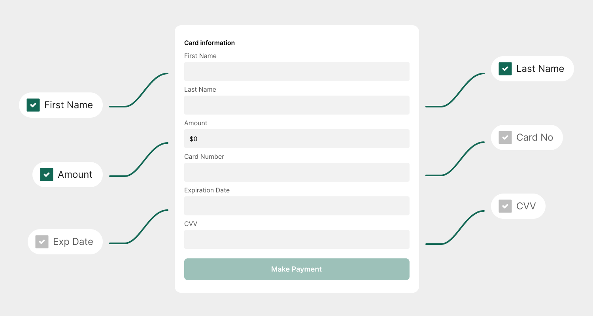

# PayForm (v1)


## Introduction

The PayForm is designed to be a highly flexible and secure payment form for your users.&#x20;

Collecting a payment or saving a card on file is a two-step process: a call is made to our REST API to initialize the payment parameters, and a payment link is generated.

You get control of all the operational and design parameters of the PayForm:



From styling



Field visibility and read-only parameters;



Initial data (cardholder names, $ amounts, etc.);



User-defined data (PatientID, ReferenceID, etc.);



Defined methods for receiving a real-time update after transactions are authorized.




**You can then present the PayForm in one of two ways:**&#x20;

<table><thead><tr><th width="132"></th><th></th></tr></thead><tbody><tr><td></td><td>As an iFrame on your website; </td></tr><tr><td></td><td>As a direct link to the PayForm.</td></tr></tbody></table>



**To generate a PayForm,** you can make a call to our REST API using a request body generated on the PayForm builder website.



***


## PayForm builder

<figure><figcaption></figcaption></figure>

It might be difficult to prepare a PayForm request by yourself at first. To make it easy to get started, we've prepared a form which can generate that for you.




### Transaction types

There are three operation types you can choose from:

* Collecting an instant card payment;
* Saving cardholder data to be charged later (card-on-file);
* Both saving the cardholder data (card-on-file) and an instant card payment.

This choice wil also pre-determine some of the required fields and submission options for you.


### Visible and read-only fields

There is a number of fields you can have added to your form. For some of the fields, you can choose to provide a default value, and to mark them as read-only.

<table><thead><tr><th width="166">Field name</th><th width="403">Description</th><th>Read-only option</th></tr></thead><tbody><tr><td>First Name</td><td>Cardholder first name. If only <code>First Name</code> is visible, field will be changed to <code>Full Name</code><strong>.</strong></td><td>yes</td></tr><tr><td>Last Name</td><td>Cardholder last name. If only <code>Last Name</code> is visible, field will be changed to <code>Full Name</code><strong>.</strong></td><td>yes</td></tr><tr><td>Address</td><td>Cardholder street address.</td><td>yes</td></tr><tr><td>City</td><td>Cardholder city.</td><td>yes</td></tr><tr><td>State</td><td>Cardholder state.</td><td>yes</td></tr><tr><td>Zip Code</td><td>Cardholder zip code.</td><td>yes</td></tr><tr><td>Amount</td><td> A total $ amount to charge, when applicable to the chosen transaction type.</td><td>yes</td></tr><tr><td>REFID</td><td>A user-defined custom field</td><td>yes</td></tr><tr><td>RPGUID</td><td>A hidden user-defined custom field</td><td>yes</td></tr><tr><td>Expiration</td><td>Expiration date on the card, <strong>required</strong>.</td><td>-</td></tr><tr><td>CVV</td><td>Security code on the back of the card, <strong>required</strong>.</td><td>-</td></tr><tr><td>Agree to Pay confirmation</td><td></td><td>-</td></tr><tr><td>Agree to Save Card on File confirmation</td><td></td><td>-</td></tr><tr><td>Email</td><td>Cardholder email address.</td><td>yes</td></tr><tr><td>Auth to Email</td><td></td><td>-</td></tr><tr><td>Logos</td><td></td><td>-</td></tr></tbody></table>


### Submission options

Based on your requirements, you can choose from many submission options explained below.

<table><thead><tr><th width="194">Submission option</th><th>Description</th></tr></thead><tbody><tr><td>Redirect external</td><td>After submitting, the user will be redirected to a provided external URL. <br><br>An encrypted string containing the POST data is appended to the URL to be consumed by the merchant.</td></tr><tr><td>Redirect internal - receipt combo</td><td><p>After submitting, the user will be redirected to an internal page displaying a combination receipt for merchant and customer. <br><br>An encrypted string containing the POST data is appended to the URL to be consumed by the merchant. </p><p></p><p>This can also be used in conjunction with <code>Silent Post</code> for the purpose of transmitting data.</p></td></tr><tr><td>Redirect internal - receipt customer</td><td>After submitting, the user will be redirected to an internal page displaying a receipt for the customer. <br><br>An encrypted string containing the POST data is appended to the URL to be consumed by the merchant.<br><br>This can also be used in conjunction with <code>Silent Post</code> for the purpose of transmitting data.</td></tr><tr><td>Redirect internal - success message</td><td>After submitting, the user will be redirected to an internal page displaying a success message and a check mark image. <br><br>An encrypted string containing the POST data is appended to the URL to be consumed by the merchant.<br><br>Sometimes used with desktop apps which use embedded browsers.</td></tr><tr><td>Silent post</td><td><p>After submitting, an encrypted string containing the POST data is sent to the provided URL to be consumed by the merchant. </p><p></p><p>The data is transmitted in the background. <strong>The user is not redirected.</strong></p></td></tr><tr><td>Post message</td><td>When the PayForm is inside of an iFrame, after submitting, an encrypted string containing the POST data is sent to the parent page to be consumed by the merchant. <strong>The user is not redirected.</strong></td></tr><tr><td>Require AVS full match</td><td>To submit the PayForm, a full AVS match must be submitted. <strong>This requires the <code>Address</code> and <code>Zip Code</code> to match exactly what is on record with the issuer for the card.</strong></td></tr><tr><td>Require AVS partial match</td><td>To submit the PayForm, a partial AVS match must be submitted. <strong>This requires that, at a minimum, there is a <code>Zip Code</code> match achieved.</strong></td></tr><tr><td>Require CVV match</td><td>To submit the PayForm, a full CVV match must be achieved. <strong>The transaction will be voided if the <code>CVV</code> does not fully match what is on file with the card issuer.</strong></td></tr><tr><td>Payment widget</td><td>This PayForm will collect a one-time payment. <strong>Automatically set when choosing the transaction type.</strong></td></tr><tr><td>Save Card on File widget</td><td>This PayForm will save the card on file for future use. <strong>Automatically set when choosing the transaction type.</strong></td></tr><tr><td>JSON post</td><td>Replace the encrypted POST data with a JSON object to be consumed.</td></tr><tr><td>Send only Transaction ID /  Consent ID</td><td>Only include the <code>TxID</code> and <code>ConsentID</code> in the data to be consumed.</td></tr></tbody></table>


### Style and colors

We care about making sure that the PayForm can match the style of your branding. You'll notice that some options are mutually exclusive.&#x20;

Here is a list of all non-default customization options that can affect the look of the PayForm:

<table><thead><tr><th width="282">Customization element</th><th>Options</th></tr></thead><tbody><tr><td>Label position</td><td>Left of the textbox, above the textbox, within the textbox.</td></tr><tr><td>PayForm corners</td><td>Semiround, round, semiround subtle.</td></tr><tr><td>Font family</td><td>Serif Font, Roboto font.</td></tr><tr><td>Required field indicators</td><td>Show.</td></tr><tr><td>Hide buttons</td><td>Hide both buttons, hide cancel button.</td></tr><tr><td>Text box size</td><td>Tall text boxes, short text boxes.</td></tr><tr><td>Background color<br>Button background color<br>Button border color<br>Button text color<br>Label text color<br>Textbox text color<br>Textbox background color</td><td>Any RGB value (can be selected using the color picker).</td></tr></tbody></table>


### Pre-filled values

Depending on your needs, you might want to have some of the values pre-filled with defaults. This will allow you to provide a default for the `First Name`, `Last Name`, `Address`, `City`, `State`, `Zip`, `Amount`, `REFID`, `RPGUID`, and `Email`.

Additionally, in this part of the builder, you can set values for the hidden config fields used by the form: `Endpoint`, `Redirect URL`, `Post URL`, and `EIndex`.

| Hidden config field | Description                                                                                                                        |
| ------------------- | ---------------------------------------------------------------------------------------------------------------------------------- |
| Endpoint            | Points to specific web application on our server. Number will provide guidance.                                                    |
| Redirect URL        | A URL to redirect the user after the payment is processed, if applicable.                                                          |
| Post URL            | A URL to POST the real-time values after the payment is completed, if applicable.                                                  |
| EIndex              | Integrator key index for encryption assigned when integrator account is first created, received with the initial login credentials |


***


## PayForm API request

Once you have the request ready, you can call our REST API to generate the PayForm and the `PaymentURL` that you can use to access it. Here's the reference to [Initialize PayForm](../../../api-reference/rest-api-v3/payform-v3.md#payform-initialize) endpoint.

Here's an example PayForm generated using the endpoint:

<figure><figcaption></figcaption></figure>


### Consuming data from the PayForm

After the payment form has been submitted and credit card authorization is completed, **you can opt to gather real-time information using JSON post, redirect with query string, or a post message to your parent page.**

When configuring the form, you may provide one or both of the following URLs:

* `POST URL` where we will POST values as either JSON stream or by appending a query string,
* `Redirect URL` to redirect to the page of your choice after transaction is completed, with or without a query string appended.

#### JSON post

Using `JSON post`, you'll be able to provide a POST URL for our servers to stream the data to. Then, you can tap into the request input stream to receive your JSON string.

Here's an example of the result and how to tap into the input stream:



```json
{
  "ConsentID": 33,
  "TransactionID": 21008,
  "CardNumber": "4511",
  "CardType": "Visa",
  "ExpireDate": "12/28",
  "Amount": 56.20,
  "Surcharge": 0.0,
  "CardholderFirstName": "Nancy",
  "CardholderLastName": "Draper",
  "CustomerFirstName": "",
  "CustomerLastName": "",
  "Email": "ndraper@easypaysolutions.com",
  "REFID": "764532#1",
  "RPGUID": "38976345",
  "ApprovalCode": "OK5013"
}
```





```csharp
public void ProcessPayFormInput(object sender, EventArgs e)
{
  string json;
  using (var reader = new StreamReader(Request.InputStream))
  {
    json = reader.ReadToEnd();
  }
  // Process the input
}
```



#### Redirect with query string

If you don't choose to use JSON post, we will webrequest your page and add query parameters to the URL. In order for you to validate the information, when configuring the form, you can choose from the following:

* If you supply **EIndex**, which is a value that defines your unique AES 256 encryption key as described above, you can read query string values as encrypted parameters (the encrypted message `m`, and the initialization vector `i`);
* Otherwise, we will supply the query parameters with no encryption and you will be able to query our API to ensure that 1. those values exist and 2. they were created in the last few moments.


When you are receiving transaction data that is not encrypted, you should validate it before storing any details in your database to avoid malicious actors creating unqualified data.


In case you're not using encryption, we recommend **validating the information**.&#x20;



#### Retrieve and validate the transaction details

Using the `TransactionID` returned by the PayForm, you can call our REST API to [retrieve full transaction details](../../../api-reference/rest-api-v3/query-v2.md#apicardprocrest-v1.0.0-query-transaction_fulldetail) (or [query transaction - full](../../../api-reference/soap-api-v2/transaction-v1.md#query-transaction-full) when using the SOAP API) to get all of the information regarding the transaction.

Then, you can confirm if a transaction with the selected ID exists, and if the `CreatedOn` date roughly matches the current time or the time the PayForm was submitted.



#### Retrieve and validate the consent details (if the card was saved)

If `ConsentID` was returned alongside the `TransactionID`, you can use the REST API to [get full detail of annual consent](../../../api-reference/rest-api-v3/query-v2.md#apicardprocrest-v1.0.0-query-consentannual_fulldetail) (or [query annual consent - full](../../../api-reference/soap-api-v2/consent-annual-v1/query-annual-consent-v1.md#query-annual-consent-full) when using the SOAP API) to get all of the information regarding the consent.

Then, you can confirm if a consent with the selected ID exists, and if the `CreatedOn` date roughly matches the current time or the time the PayForm was submitted.



With this, **you can avoid malicious actors filling your database with unqualified transaction data**.

#### Post message

In this method, the PayForm you have rendered in your iFrame will message your parent page directly.

Here are example scripts for your parent page to listen for the message provided by the PayForm:



```javascript
// Listen for post messages from an iFrame
window.addEventListener('message', (event) => {
  const resultsMessage = document.getElementById('results');

  // Ensure the message is from a trusted origin
  const trustedOrigin = 'https://easypay5.com'; // use PayForm origin
  if (event.origin !== trustedOrigin) {
    console.warn('Received message from untrusted origin:', event.origin);
    return;
  }

  // Update the innerHTML with the message data
  resultsMessage.innerHTML = event.data;

  // Optionally, handle the message data further
  // alert(event.data);
});
```



```javascript
// addEventListener support for IE8
function bindEvent(element, eventName, eventHandler) {
  if (element.addEventListener) {
    element.addEventListener(eventName, eventHandler, false);
  }
  else if (element.attachEvent) {
    element.attachEvent('on' + eventName, eventHandler);
  }
}

// Listen to message from child window
bindEvent(window, 'message', function(e) {
  var resultsMessage = document.getElementById('results');
  resultsMessage.innerHTML = e.data;
  // Optionally, handle the message data further
  // alert(e.data);
});

```



If your implementation is using encryption, after decrypting, you'll get a string which can look like this:

```
TRANSACTIONID|174|CONSENTID|213|CARDNO|5339|CARDTYPE|Amex|FIRSTNAME|Bob|LASTNAME|smith|REFID|7899
```

If you are not using encryption, the message will contain less information, and can look like this:

```
TXID|174|CID|213
```



#### Requesting additional transaction and consent details

Having the `TransactionID` and `ConsentID`, you can use our REST API to:

* Gather additional informating concerning the sale;
  * For the REST API, you can use [full transaction details](../../../api-reference/rest-api-v3/query-v2.md#apicardprocrest-v1.0.0-query-transaction_fulldetail), and [full consent details](../../../api-reference/rest-api-v3/query-v2.md#apicardprocrest-v1.0.0-query-consentannual_fulldetail) methods;
  * For the SOAP API, you can use [query transaction - full](../../../api-reference/soap-api-v2/transaction-v1.md#query-transaction-full), and [query annual consent - full](../../../api-reference/soap-api-v2/consent-annual-v1/query-annual-consent-v1.md#query-annual-consent-full);
* Provide a receipt;
  * For the REST API, you can use [generate a transaction receipt](../../../api-reference/rest-api-v3/receipt-v2.md#apicardprocrest-v1.0.0-receipt-receiptgenerate) method;
  * For the SOAP API, you can use [generate receipt](../../../api-reference/soap-api-v2/receipt-v1.md#generate-receipt) method.


