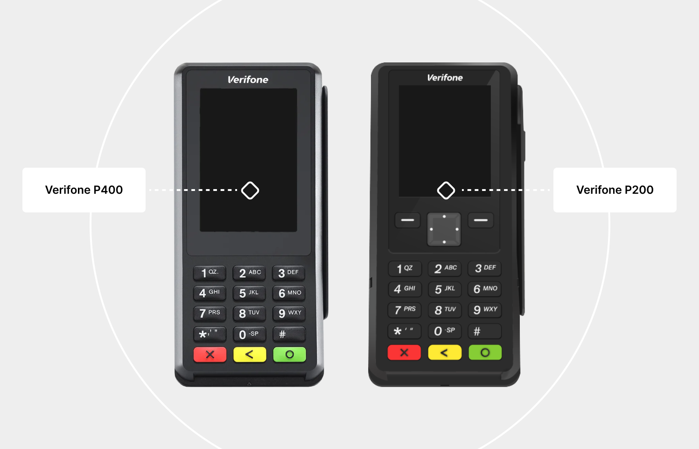

# Verifone (WIP)

### Introduction

Using the VeriFone Chip Readers offers a highly secure method of collecting cardholder data.

Cardholder data Is encrypted within the device itself, and remains encrypted as it travels across the internet to our PCI Level One Compliant processing platform. When a merchant supports this type of reader, they also help with eliminating charge backs for transactions which were run through the device.

<figure><figcaption></figcaption></figure>

#### PCI SSC Software Security Framework (SSF) 

Software Security Framework is a re-working of the existing PCI standard PA DSS. The PA DSS is going to be retired on June 30, 2021


**Note**

Number's "Aspen 3.1" is the first application to achieve the PCI Councils newest certification, SSF. The use of the "Aspen 3.1" software by an integrator or merchant provides an End-to-End Encrypted (E2EE) solution! LINK


#### Architecture

The Verifone card readers are small hand-held devices, and they communicate with your computer on a USB port. A typical chip transaction is comprised of about a dozen transmissions back and forth between host (your computer) and device (VeriFone Device) and then finally off to the Easy Pay cloud platform.

***

### What We Offer 

Currently we offer four different options for collecting payments with the Verifone card readers (Windows OS Only):



#### Standalone Desktop Application (Upon Request Only) 

This application does the following:

* Collect Payments
* Create Card-on-File (Annual Consent)
* Create Card-on-File Payment Plans (Fixed Recurring Consent)
* Process Card-on-File
* Void / Credit (Refund)
* Settlements
* Reporting (with export to PDF)



#### Easy Pay Verifone SDK 

This is simply a DLL written in C# MANAGED code and it provides a means of collecting payments and creating Card-on-File plans. Used in conjunction with our API, you can basically manage all aspects of your payment requirements, and all within the confines of your own custom application.



#### Browser based Interface 

In order to interface with browser content Number has developed a windows service which uses Cross-Origin Resource Sharing (CORS) to communicate with the browser (EDGE, Mozilla, Chrome). This allows our Integrators to write simple client-side script within THEIR OWN web applications which will initiate transactions with the local Verifone.&#x20;

A very simple HTML site can be downloaded [HERE](https://easypay7.com/docs/jquery_verifone.zip) which will show exactly how you can interact with our VeriFone from your own web applications. No cardholder data is transferred to the Integrator site as it is END to END encryption between the Verifone, Win Service, and EasyPay Cloud Servers. The Win service will return a simple XML response for each transaction directly to the HTML/PHP/ASP.NET page for consumption by the Host application.



#### Virtual Terminal 

Our Number Virtual Terminal has built in support for Verifone. One would need to install the middleware service and ask for this feature to be activated. You can download the Windows service [HERE](https://easypay7.com/deploy/MiddleWare/EPVerifoneSetup_E2E_1041.zip)

\
**Requirements:**

There are 2 categories of integrations which require two different sets of files

1. Browser Based Integrations (Install our Win Service which contains all your dependencies including the drivers and console installer)
2. Desktop Based Integrations (Install Our SDK) (Here you will need a separate install for the Drivers and custom event Log installer)


Regardless of your integration it is recommended to adjust your Power plan settings to ensure your USB port does not suspend or sleep




***

### Easy Pay Verifone SDK 

For you to DIRECTLY interface with the VeriFone using our SDK, you will need two components.

1. The VeriFone drivers and Custom Logging package ([HERE](https://easypay7.com/deploy/SetupVerifoneDrivers/Setup_USB_log_win11.zip))
2. The actual SDK reference files ([HERE](https://easypay7.com/deploy/VerifoneSDK/EP.Enterprise.Vx820Lib2.zip))

The following files are included in the SDK. You only need to interface directly to the file named EP.Enterprise.Vx820.dll. The other 3 files are dependencies.

<table><thead><tr><th width="117"></th><th></th></tr></thead><tbody><tr><td></td><td>EP.Enterprise.Vx820Lib.dll</td></tr><tr><td></td><td>EP.Vx820.Common.dll</td></tr><tr><td></td><td>EP.Enterprise.Vx820Lib.dll.config</td></tr><tr><td></td><td>DPayments.DPaymentsSDK.dll</td></tr></tbody></table>

***

The first component, when installed correctly will provide USB drivers and create a Virtual COM 9 port. In addition, it will add a unique EVENT LOG to the existing windows Event Log collection. To install THE FIRST COMPONENT please do the following:



Connect your Verifone to the USB port which you plan to utilize.



Wait until the device is fully initialized.



Download and extract the ZIP file named Setup\_USB\_log.zip to the location of your choice.



Right click the EXE named Setup\_USB\_log.exe and choose RUN AS ADMINISTRATOR



Once the installation is complete you can verify the new windows event log named EPMIDDLEWARE



<figure><figcaption></figcaption></figure>

***

### Browser based Installation 

To install our Win Service please download the ZIP file [HERE](https://easypay7.com/deploy/MiddleWare/EPVerifoneSetup_E2E_1041.zip).



Connect your device to free USB port



Allow device to initialize



Extract the above archive to location of your choice



Locate the EXE file (application)



Right Click on EXE



Run As Admin (important)



Wait for application to finish then Reboot computer



**The above install package does the following**

1. Installs USB drivers for the Verifone
2. Creates a Custom Event Log with windows named EPmiddleware
3. Installs a Certificate which encrypts data between the browser and the Windows service
4. Install the windows service which listens on Port 8031


Your website can now issue commands to the Win Service as is demonstrated using the sample site:

[https://easypay7.com/JqueryVerifone/](https://easypay7.com/JqueryVerifone/)


\
**You can download the entire site here:**



#### Virtual Terminal

Our EasyPay Virtual Terminal has built in support for Verifone. One would need to install the service and ask for this feature to be activated.

***

### Custom Windows Event Log

\
Once the installation program has completed you will notice a new Windows Event Log has been registered named EPmiddleWare. This log is relevant for both SDK and Browser based Middleware.

The Custom Windows Event Log stores relevant information while it processes transactions as well as any errors encountered. This becomes a powerful troubleshooting component should the merchant have any problems. They would simply export the log and send it to Easy Pay if any unexpected behavior is encountered.

<figure><figcaption></figcaption></figure>

***

### Verifone Optimum Power Settings

It is important to note that the middleware service ( or SDK ) , once started, will attempt to maintain a continuous connection to the Verifone device. If your hardware goes into suspending or sleep mode, this can cause issues and prevent seamless operation. To avoid these issues please make sure to modify your USB Power settings as follows:

#### Windows 10

<figure><figcaption></figcaption></figure>

<figure><figcaption></figcaption></figure>

#### Windows 11

<figure><figcaption></figcaption></figure>

<figure><figcaption></figcaption></figure>


**Important**&#x20;

If you dont see USB power settings on your machine then you need to expose them as follows:

Run a Command Prompt (RUN AS ADMINISTRATOR)

Type the command below you into the elevated command prompt, and press Enter.

**REG ADD HKLM\SYSTEM\CurrentControlSet\Control\Power\PowerSettings\2a737441-1930-4402-8d77-b2bebba308a3\48e6b7a6-50f5-4782-a5d4-53bb8f07e226 /v Attributes /t REG\_DWORD /d 2 /f**

_After running command, reboot your computer and then reopen your advanced power settings following the steps listed above._\



***

### End-To-End Encryption 

<figure><figcaption></figcaption></figure>

***

### Number EMV Integration Options with End to end Encryption

#### Number VxModule

<figure><figcaption></figcaption></figure>

#### Number Browser Integration

<figure><figcaption></figcaption></figure>

#### Number Desktop Application / with Automatic Updates

<figure><figcaption></figcaption></figure>
