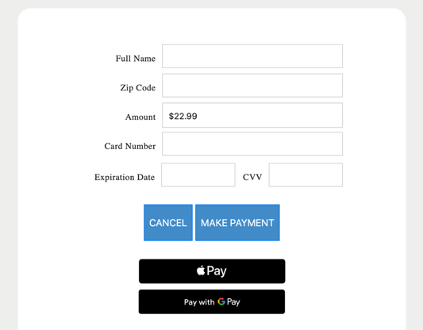

# Apple Pay / Google Pay

In order to add Apple Pay / Google Pay functionality to your PayForm you modify your [request](../../../../api-reference/rest-api/payform.md) as follows:

**Standard Payform :**


```
"EndPoint": "PayForm/PF.aspx",
```


**Add Apple Pay / Google Pay :**


```
 "EndPoint": "PayForm/PFA.aspx",
```


#### Considerations&#x20;

**1) Notify us that you are ready to Test**  (we will modify your test account)

***

**2) Size** - If our PayForm determines that Apple Pay or Google Pay can be used during the browser session you will notice the following extra buttons will appear: Your PayForm will grow vertically depending on what is detected

<figure><figcaption></figcaption></figure>


***

**3) Domain -** If you plan to display our widget within an IFRAME we will need to get your Domain approved (Apple Pay Only).  Contact our tech team to accomplish this. We will have you publish a small text file on your web server which Apple will discover.\
\
**4) SandBox -** In order to get approvals in the sandbox (Apple Pay Only) you will need:\
\- A Sandbox Apple ID (different from your real Apple ID)\
\- An iPhone or iPad that supports Apple Pay.\
\- The device must be signed into iCloud with the sandbox account, not your normal Apple ID.<br>

#### Step-by-step: How to get test cards into your Apple Pay Wallet

1. **Create a Sandbox Apple ID** \
   Go to Apple’s developer site → _Account_ → _Users and Access_ → _Sandbox Testers_. Create a new tester account (email must be unique and not tied to an existing Apple ID).
2. **Sign out of your real Apple ID on your device**\
   Settings → Your Name → _Sign Out_.
3. **Sign in with the Sandbox Apple ID**\
   Settings → Sign in → use the sandbox credentials.
4. **Open the Wallet app**\
   Once the device is in sandbox mode, You can begin to add Sandbox test cards to your **Apple Pay Wallet (**&#x74;ap **Add Card)**.&#x20;
5. **This link has valid test cards you can put in your wallet:**\
   [Sandbox Testing - Apple Pay - Apple Developer](https://developer.apple.com/apple-pay/sandbox-testing/)
6. **Use the cards only in sandbox-supported apps/sites**\
   They will not work in production environments. Real cards are required for production testing.


## Google Pay Considerations&#x20;

To test Google Pay in our PayForm you need to do the following&#x20;

**1) Notify us that you are ready to Test** (we will modify your test account)

2\) **Make sure you are logged in to your google account**&#x20;

3\) **Open your Easy Pay PayForm using your test Account**&#x20;

3\)  **The Google Sandbox Wallet should become available automatically**&#x20;

4\) **Once you are ready to Pay you will see a message** which indicates that no actual funds will be charged in the TEST ENVIRONMENT.&#x20;


<figure><figcaption></figcaption></figure>

&#x20;
