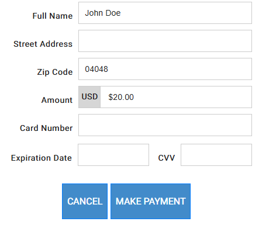
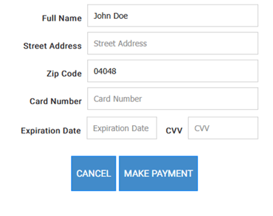

# Subscription

In order to do this you will want to provide the following:&#x20;

```
"eSubmission": "0221",
```

This will provide for your final redirect address as well as a webhook URL

Here are other changes you will need to consider:&#x20;

> "eSubmission": "0221",\
> "WTYPE": "PFS",\
> "EndPoint": "Payform/PFS.aspx",\
> "PostURL": "HTTPS://easypay1.com/postingapp/submit.aspx", <mark style="color:$danger;">// your webhook location</mark>\
> "RedirectURL": "https://easypay8.com/CYWidget/", <mark style="color:$danger;">// your redirect URL</mark>

You can add the following section to your initialization request to describe your desired subscription:

> "Subscription": {\
> "Amount": 20.0,\
> "Period": "WEEKLY",\
> "FirstPayDate": "2026-02-11"\
> },

Note:  _You must use a date which is today or future, or an error will occur._

**Valid subscription periods:**

* WEEKLY
* BI\_WEEKLY
* TWICE\_MONTHLY
* MONTHLY
* BI\_MONTHLY
* QUARTERLY
* SEMI\_ANNUALLY
* ANNUALLY

### Operation

The Subscription PayForm is designed to do the following:

1. Collect an independent Fee ( optional )
2. Create a Subscription consent ( stored card )
3. Do the initial charge ( depending on "FirstPayDate":)

&#x20;**Fig 1  (when a fee is also required):**&#x20;



```
"eVisible": "0665",
"eReadOnly": "0040",
"eStyles": "0001",
"eSubmission": "0221",

"Amounts": {
 "Amount": 20,
 "Surcharge": 0,
 "TotalAmt": 20
 },
```



<figure><figcaption></figcaption></figure>



&#x20;**Fig 2 (when NO fee is required initially):**



```
"eVisible": "0625",
"eReadOnly": "0040",
"eStyles": "0001",
"eSubmission": "0221",

"Amounts": {
 "Amount": 0,
 "Surcharge": 0,
 "TotalAmt": 0
 },
```



<figure><figcaption></figcaption></figure>



**Here is a full request (for Fig 2):**

```
{
  "InitParams": {
    "MerchID": 1,
    "WTYPE": "PFS",
    "PostURL": "HTTPS://easypay1.com/postingapp/submit.aspx",
    "RedirectURL": "https://easypay8.com/CYWidget/",
    "REF_ID": "A97689#",
    "RPGUID": "92e1e15c-f64a-466b-8733-9b518b9f374c",
    "EndPoint": "PayForm/PFS.aspx",
    "EINDEX": "300",
    "Amounts": {
      "Amount": 0, (only if you want to collect a separate fee) 
      "Surcharge": 0,
      "TotalAmt": 0
    },
    "Payer": {
      "Firstname": "John Doe",
      "Lastname": "",
      "BillingAddress": {
        "StreetAddress": "",
        "City": "",
        "State": "",
        "ZIP": "04048",
        "Country": ""
      },
      "Email": "",
      "Phone": ""
    },
    "Subscription": {
        "Amount": 120,
        "Period": "WEEKLY",
        "FirstPayDate": "2026-02-11"
     },
    "WidOptions": {
      "eVisible": "0625",
      "eReadOnly": "0040",
      "eStyles": "0001",
      "eSubmission": "0221",
      "eColors": "#ffffff,#428bca,#007bff,#212121,#ffffff,#212121,#ffffff"
    }
  }
}

```

### Behavior

You will continue to get webhooks throughout the lifetime of your subscription

**Here are some examples:**

```
{
    "acctid":5325,
    "type":"SUBSCRIP_CREATE",
    "refid":"A97689#",
    "rpguid":"92e1e15c-f64a-466b-8733-9b518b9f374c",
    "cardholder":"John Doe",
    "email":"",
    "subscription":{
        "id":15,"amount":120000,
        "result":"SUCCESS","period":"WEEKLY",
        "startdate":"2/11/2026",
        "nextdate":"2/18/2026",
        "status":"ACTIVE",
        "errcode":0,
        "errmsg":"NA"
    }
}
```

```
{
    "acctid":5325,
    "type":"SUBSCRIP_PAYMENT",
    "refid":"A97689#",
    "rpguid":"92e1e15c-f64a-466b-8733-9b518b9f374c",
    "cardholder":"John Doe",
    "email":"",
    "subscrip_id":15,
    "transaction":{
        "id":100,
        "amount":120000,
        "result":"APPROVED",
        "txncode":"OK2194",
        "errcode":0,
        "errmsg":"NA"
    }
} 
```

### Cancelling a subscription

[Cancel a consent subscription | Docs](https://docs.number.tech/api-reference/rest-api/consent-subscription/cancel-a-consent-subscription)
