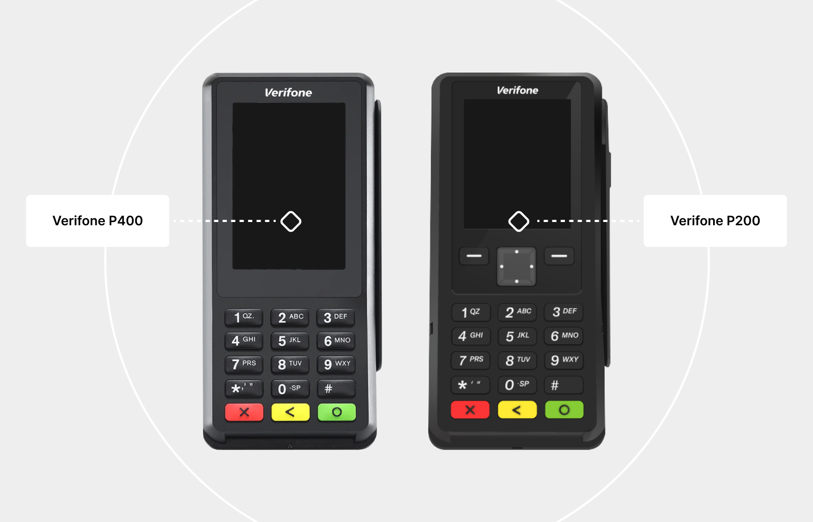

# Verifone

Introduction

The Verifone card readers are small hand-held devices. They communicate with your computer on a USB port. A chip transaction is comprised of about a dozen transmissions between the host (your computer) and the device, and then finally to the Number cloud platform.

Using the Verifone card readers offers a highly secure method of collecting cardholder data.

Cardholder data is encrypted within the device itself, and remains encrypted as it travels across the Internet to our PCI Level One Compliant processing platform.&#x20;


When a merchant supports a Verfione card reader, it helps eliminate chargebacks for transactions which were run through the device.


<figure><figcaption></figcaption></figure>


### PCI SSC SSF <a href="#pci-ssc-software-security-framework-ssf" id="pci-ssc-software-security-framework-ssf"></a>

Software Security Framework (SSF) is a re-working of the existing PCI standard PA DSS. The PA DSS has been retired since June 30, 2021. Number's "Aspen 3.1" is the first application to achieve the PCI Councils SSF certification, and it provides an end-to-end encrypted solution.

<figure><figcaption></figcaption></figure>


***


## Software options <a href="#what-we-offer" id="what-we-offer"></a>

Currently, we offer four different options for collecting payments with the Verifone card readers, all of which require a Windows OS on the host computer.



**Standalone desktop application (upon request)**

This application has automatic updates and allows you to collect payments, create card-on-file and payment plans, process a card-on-file, void or credit, settle transactions, and do reporting with an option to export to a PDF.



**Number Verifone SDK**

This DLL provides a means of collecting payments and creating card-on-file plans. Used in conjunction with our API, you can manage all aspects of your payment requirements, all within the confines of your own custom application.



**Browser-based interface**

We developed a Windows service which uses Cross-Origin Resource Sharing (CORS) to communicate with the browser. As an integrator, this allows you to write simple client-side scripts within your own web applications to initiate transactions with a local Verifone.&#x20;

The Win service will return a simple XML response for each transaction directly to the HTML/PHP/ASP.NET page for consumption by the host application.



Virt**ual Terminal**

Our Number Virtual Terminal has a built-in support for Verifone. After installing the middleware service, you can ask the Number team for this feature to be activated.&#x20;



#### **Requirements**

There are 2 categories of integrations which require two different sets of files

1. Browser-based - install our Win service which contains all your dependencies, including the drivers and console installer;
2. Desktop-based - install our SDK, then use separate installers for drivers and a custom event log.


## Desktop application <a href="#easy-pay-verifone-sdk" id="easy-pay-verifone-sdk"></a>

<figure><figcaption></figcaption></figure>

If you wish to use the standalone desktop application for Verifone, contact Number for installation files and instructions.


## Number Verifone SDK <a href="#easy-pay-verifone-sdk" id="easy-pay-verifone-sdk"></a>

<figure><figcaption></figcaption></figure>

For you to directly interface with the Verifone using our SDK, you will need the Verifone drivers with the custom logging package, and the SDK reference files:

<table data-card-size="large" data-view="cards"><thead><tr><th align="center" valign="middle"></th><th data-hidden data-card-target data-type="content-ref"></th></tr></thead><tbody><tr><td align="center" valign="middle">Verifone drivers and the <br>custom logging package</td><td><a href="https://easypay1.com/deploy/SetupVerifoneDrivers/Setup_USB_log_win11.zip">https://easypay1.com/deploy/SetupVerifoneDrivers/Setup_USB_log_win11.zip</a></td></tr><tr><td align="center" valign="middle">Verifone SDK reference files</td><td><a href="https://easypay1.com/deploy/VerifoneSDK/EP.Enterprise.Vx820Lib2.zip">https://easypay1.com/deploy/VerifoneSDK/EP.Enterprise.Vx820Lib2.zip</a></td></tr></tbody></table>

When installed, the first component will provide USB drivers and create a virtual COM 9 port. In addition, it will add a unique event log to the existing windows event log collection.&#x20;

To install the first component, please do the following:



Connect your Verifone to the USB port which you plan to utilize.



Wait until the device is fully initialized.



Download and extract the ZIP file named _Setup\_USB\_log.zip_ to the location of your choice.



Right click the EXE named _Setup\_USB\_log.exe_ and choose _Run as administrator_.



After installation, there should be a new windows event log named _EPmiddleWare_.



<figure><figcaption></figcaption></figure>

To use the SDK, you only need to directly interface to the file named _EP.Enterprise.Vx820.dll_. The other files are dependencies. Make sure to extract all 4 of the files to the location of your choice.

<table data-header-hidden><thead><tr><th width="117"></th><th></th></tr></thead><tbody><tr><td></td><td>EP.Enterprise.Vx820Lib.dll</td></tr><tr><td></td><td>EP.Vx820.Common.dll</td></tr><tr><td></td><td>EP.Enterprise.Vx820Lib.dll.config</td></tr><tr><td></td><td>DPayments.DPaymentsSDK.dll</td></tr></tbody></table>


## Browser-based installation <a href="#browser-based-installation" id="browser-based-installation"></a>

<figure><figcaption></figcaption></figure>

Before you start, download the Windows service to your machine.



To install the Win service:



Connect your device to a free USB port.



Allow the device to initialize.



Extract the above archive to a location of your choice.



Locate the EXE file and right click on it to choose _Run as administrator_.



Wait for the application to finish, then reboot computer.



The above installation package does the following:

1. Installs USB drivers for the Verifone.
2. Creates a custom event log with Windows named _EPmiddleware_.
3. Installs a certificate which encrypts data between the browser and the Windows service.
4. Installs the Windows service which listens on port 8031.

With this, your website will be able to issue commands to the Windows service. You can see [our example website](https://easypay7.com/JqueryVerifone/) communicating with Verifone.

You can also download the entire site to see how it works:




### Virtual Terminal

Our Virtual Terminal has a built-in support for Verifone. All you need to do is install the service, then contact Number to have this feature activated.


### Requesting a transaction

You can call the middleware to do the following:

1. Chip sale (EMV sale) only;
2. EMV sale (chip sale) and save card;
3. Manual sale (keyed entry sale) only;
4. Manual sale (keyed entry sale) and save card.

```javascript
// EMV sale only
$(function() {
    $('#EMVSaleOnly').click(function() {
        EMVSaleCombo(false);
    });
});

// EMV sale and save card
$(function() {
    $('#EMVSaleAndSave').click(function() {
        EMVSaleCombo(true);
    });
});

// Manual sale only
$(function() {
    $('#ManualSaleOnly').click(function() {
        ManualSaleCombo(false);
    });
});

// Manual sale and save card
$(function() {
    $('#ManualSaleAndSave').click(function() {
        ManualSaleCombo(true);
    });
});
```


### Resetting the device

The red button on the Verifone can be used to cancel the current operation and set up for _Ready_ state in most cases. See the `ResetVerifone` and `UnlockVerifone` commands.

```javascript
// Reset button
$(function () {
    $('#ResetButton').click(function() {
        ResetVerifone();
    });
});

// Unlock button
$(function () {
    $('#UnlockButton').click(function () {
        UnlockVerifone();
    });
});
```

The `ResetVerifone` operation will send a reset command to the Verifone device. This can be used to put the device back into _Ready_ state.

The `UnlockVerifone` operation will release the middleware from its current wait state or workflow and also send a reset command to the device.&#x20;


If, for any reason, you continue to receive a _Busy_ response from the middleware, but you don't believe that waiting will yield productive results, you may use the `UnlockVerifone` feature to return the device to _Ready_ state.



### Middleware response types

For browser type Verifone operations, the middleware provides a response object in XML format. This object can be de-serialized or can be consumed as XML. Currently, there are two response object types:

1. `WidgetArgs` - sale response when **requesting an authorization for a non-zero dollar amount**, with the option to save the card;
2. `WidgetArgs2` - consent response when **requesting to only save the card**.


### Consuming the sale response

It is important to consume the `WidgetArgs` response in a particular order, starting with `TxEventType`.




```xml
<?xml version="1.0" encoding="utf-16"?>
<WidgetArgs xmlns:xsi="http://www.w3.org/2001/XMLSchema-instance" xmlns:xsd="http://www.w3.org/2001/XMLSchema">
    <TxEventTyp>TxApproved</TxEventTyp>
    <ApprovedAmt>20</ApprovedAmt>
    <IsPartialApproval>false</IsPartialApproval>
    <RespMsg>APPROVED 801193</RespMsg>
    <ErrMsg />
    <TxnCode>801193</TxnCode>
    <TxID>19969</TxID>
    <ErrCode>0</ErrCode>
    <Mask>4663xxxxxxxx2741</Mask>
    <cardType>Visa</cardType>
    <ConsentResult>
        <ConsentCreated>true</ConsentCreated>
        <ConsentRequested>true</ConsentRequested>
        <ErrMsg />
        <ErrCode>0</ErrCode>
        <ConsentID>7849</ConsentID>
        <CardLast4>2741</CardLast4>
        <ExpDate>0528</ExpDate>
    </ConsentResult>
</WidgetArgs>
```


***

`TxEventType` string

The type of event that occurred during the transaction, indicating success or failure.

Values: TxApproved, TxDecline, TxReversed, PreSaleDeviceCode, PostSaleDeviceCode, TimeOut, AspenError, AuthFail, FunctionFail, Exception.

***

Here are actions to take for each possible value of `TxEventType`:



**TxApproved**

The sale was approved by the issuer. You should examine and store these values:

* `TxID` - the unique ID of the transaction; needed to refund or void the transaction.
* `TxnCode` - the transaction approval code.
* `ApprovedAmt` - the $ amount charged to the card.



**TxDecline**

The sale was declined by the issuer. You should examine and store these values:

* `TxID` - the unique ID of the declined transaction.
* `TxnCode` - the transaction decline code.



**TxReversed**

The issuer approved the transaction, however, during the final interaction with the chip, the device required the transaction to be declined, and the transaction was voided (reversed).



**PreSaleDeviceCode**

An error occurred within the device prior to the transaction getting submitted to the issuer. Examine `ErrCode` and `ErrMsg` for more information.



**PostSaleDeviceCode**

An error occurred within the device after the transaction was submitted to the issuer. Examine `ErrCode` and `ErrMsg` for more information.



**Timeout**

The user waited too long to insert the card or interact with the device. Examine `ErrCode` and `ErrMsg` for more information.



#### AspenError

An error occurred on Number Aspen Cloud processing servers. Examine `ErrCode` and `ErrMsg` for more information.



**AuthFail**

When doing a save card only operation, the issuer declined to verify the card details when executing a $0 authorization. The card will not be saved. You should examine:

* `TxID` - the unique ID of the declined transaction.
* `TxnCode` - the transaction decline code.



**FunctionFail**

Returned when you supply improper or out of range values in the request, or when you execute a Verifone command while the previous action has not yet completed. Examine `ErrCode` and `ErrMsg` for more information.



**Exception**

An error was encountered in the local Windows service. Examine `ErrCode` and `ErrMsg` for more information.




### Consuming the consent response

It is important to consume the `WidgetArgs2` response in a particular order, starting with `ConsentEventType`.




```xml
<?xml version="1.0" encoding="utf-16"?>
<WidgetArgs2 xmlns:xsi="http://www.w3.org/2001/XMLSchema-instance" xmlns:xsd="http://www.w3.org/2001/XMLSchema">
    <ConsEventTyp>ConsentSuccess</ConsEventTyp>
    <AuthSuccess>true</AuthSuccess>
    <AuthMsg>APPROVED 632641|CVV||AVS|0</AuthMsg>
    <AuthTxID>16809</AuthTxID>
    <RespMsg>Success : Created Consent ID : 001270</RespMsg>
    <ErrMsg />
    <ConsentID>1270</TxnCode>
    <ErrCode>0</ErrCode>
    <Mask>4663xxxxxxxx2741</Mask>
    <cardType>Visa</cardType>
</WidgetArgs>
```


***

`ConsentEventType` string

The type of event that occurred during the save card on file operation, indicating success or failure.

Values: ConsentSuccess, ConsentFailed, PreConDeviceCode, PostConDeviceCode, TimeOut, AspenError, AuthFail, FunctionFail, Exception.

***

Here are actions to take for each possible value of `ConsentEventType`:



**ConsentSuccess**

The consent was created and card was saved successfully. You should examine and store `ConsentID` to be able to charge the customer later.



**ConsentFailed**

The consent was not created. Examine `ErrCode` and `ErrMsg` for more information.



**PreConDeviceCode**

An error occurred within the device prior to the card being submitted. Examine `ErrCode` and `ErrMsg` for more information.



**PostConDeviceCode**

An error occurred within the device after the data was submitted. Examine `ErrCode` and `ErrMsg` for more information.



**Timeout**

The user waited too long to insert the card or interact with the device. Examine `ErrCode` and `ErrMsg` for more information.



#### AspenError

An error occurred on Number Aspen Cloud processing servers. Examine `ErrCode` and `ErrMsg` for more information.



**AuthFail**

When doing a save card only operation, the issuer declined to verify the card details when executing a $0 authorization. The card will not be saved.



**FunctionFail**

Returned when you supply improper or out of range values in the request, or when you execute a Verifone command while the previous action has not yet completed. Examine `ErrCode` and `ErrMsg` for more information.



**Exception**

An error was encountered in the local Windows service. Examine `ErrCode` and `ErrMsg` for more information.




***


## Custom Windows event log

After installing all the dependencies for either the SDK or the browser-based approach,, you will notice a new Windows event log has been registered named _EPmiddleWare_.&#x20;

This event log stores information about processed transactions as well as any errors encountered, and serves as a powerful troubleshooting component.


With the Verifone Windows event log installed, a merchant can export the log and send it to Number if any unexpected behavior is encountered.


<figure><figcaption></figcaption></figure>


***


## Verifone power settings

Both the middleware service and the SDK will attempt to maintain a continuous connection to the Verifone device. If your hardware is suspended or enters sleep, this can cause issues. To avoid these, please make sure to modify your USB power settings.

#### Windows 10 and Windows 11

For Windows 10, you'll need to go to Control Panel > Power Options > Edit Plan Settings.

On Windows 11, open Control Panel > Hardware and Sound > Power Options > Edit Plan Settings.

Go to _Advanced power settings_ and change the _USB settings_ to disable _USB selective suspend_ for your active power plan.


When using the Verifone, **make sure that your machine is running the power plan with the modified settings**. All power plans have separate power settings.


<figure><figcaption></figcaption></figure>

<figure><figcaption></figcaption></figure>


If you don't see the USB power settings on your machine, you might need to expose them.

1. Run the Command Prompt as an administrator.
2. Type the command below you into the elevated command prompt, and press Enter:


```
REG ADD HKLM\SYSTEM\CurrentControlSet\Control\Power\PowerSettings\2a737441-1930-4402-8d77-b2bebba308a3\48e6b7a6-50f5-4782-a5d4-53bb8f07e226 /v Attributes /t REG_DWORD /d 2 /f
```


3. After running the command, reboot your computer, then reopen your advanced power settings following the steps listed above.



