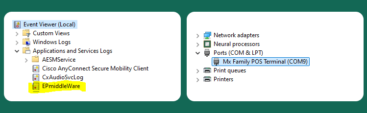

# Verifone

The Verifone card readers are small hand-held devices. They communicate with your computer on a USB port. A chip transaction is comprised of about a dozen transmissions between the host (your computer) and the device, and then finally to the Number cloud platform.

Using the Verifone card readers offers a highly secure method of collecting cardholder data.

Cardholder data is encrypted within the device itself, and remains encrypted as it travels across the Internet to our PCI Level One Compliant processing platform.&#x20;


When a merchant supports a Verifone card reader, it helps eliminate chargebacks for transactions which were run through the device.


<figure><figcaption></figcaption></figure>


### PCI SSC SSF <a href="#pci-ssc-software-security-framework-ssf" id="pci-ssc-software-security-framework-ssf"></a>

Software Security Framework (SSF) is a re-working of the existing PCI standard PA DSS. The PA DSS has been retired since June 30, 2021. Number's "Aspen 3.1" is the first application to achieve the PCI Councils SSF certification, and it provides an end-to-end encrypted solution.

<figure><figcaption></figcaption></figure>


***


## Software options <a href="#what-we-offer" id="what-we-offer"></a>

Currently, we offer three different options for collecting payments with the Verifone card readers, all of which require a Windows OS on the host computer.



**Standalone desktop application (upon request)**

This application has automatic updates and allows you to collect payments, create card-on-file and payment plans, process a card-on-file, void or credit, settle transactions, and do reporting with an option to export to a PDF.



**Browser-based interface**

We developed a Windows service which uses Cross-Origin Resource Sharing (CORS) to communicate with the browser. The Win service will return a simple XML response for each transaction directly to the HTML/PHP/ASP.NET page for consumption by the host application.

As an integrator, this allows you to write simple client-side scripts within your own web applications to initiate transactions with a local Verifone. **You can also use this service with our Virtual Terminal to avoid writing any code.**



**Number Verifone SDK**

This DLL provides a means of collecting payments and creating card-on-file plans. Used in conjunction with your custom windows application, you can manage all aspects of your payment requirements.



#### **Requirements**

There are 2 categories of integrations which require two different sets of files

1. Browser-based - install our Win service which contains all your dependencies, including the drivers and console installer.
2. Desktop-based - install our SDK, then use separate installers for drivers and a custom event log.


## Desktop application <a href="#easy-pay-verifone-sdk" id="easy-pay-verifone-sdk"></a>

<figure><figcaption></figcaption></figure>

If you wish to use the standalone desktop application for Verifone, [contact Number ](../../../help/customer-support/)for installation files and instructions.


## Browser-based installation <a href="#browser-based-installation" id="browser-based-installation"></a>

For any browser-based Implementation using the Verifone, you will need to install the local win service. This includes our Virtual Terminal implementation as well as your own custom web applications.

<figure><figcaption></figcaption></figure>

To Begin: Download the compressed archive:

#### [Verifone Middleware Installer](https://easypay1.com/deploy/MiddleWare/EPVerifoneSetup_E2E_1041.zip) 

**To install the Win service:**



Connect your device to a free USB port.



Allow the device to initialize.



Extract the above archive to a location of your choice.



Locate the EXE file and right click on it to choose _Run as administrator_.



Wait for the application to finish, then reboot computer.



The above installation package does the following:

1. Installs USB drivers for the Verifone.
2. Creates a custom event log with Windows named _EPmiddleware_.
3. Installs a certificate which encrypts data between the browser and the Windows service.
4. Installs the _EasyPay Verifone MiddleWare E2E 1041 Service_ which listens on port 8031.

Your website can now issue commands to the Win Service as is demonstrated using the sample site:&#x20;

[Sample Verifone Website](https://easypay1.com/JqueryVerifone/)

You can download the entire site here:

[Sample Verifone Website Content](https://easypay1.com/docs/jquery_verifone.zip)


To run the Verifone demo website, you must have the Verifone Windows service installed.


### Virtual Terminal

You can use our Virtual Terminal together with the Windows service. It has built-in support for Verifone. This way, you won't have to build your own UI or write any code. After installing the service, [contact Number](../../../help/customer-support/) to have this feature activated.

You can read more about using the Virtual Terminal in the [virtual-terminal.md](virtual-terminal.md "mention") guide.


### Requesting a transaction from your custom web application

You will find a script file named EasyPayVerifone.js in the sample VeriFone website provides the following functionality:

1. EMV sale only
2. EMV sale and save card
3. Manual sale (keyed entry) sale only
4. Manual sale and save card
5. EMV save card only
6. Reset the Middleware and Verifone

#### You can call these functions as follows:

```clike
// EMV Sale Only
$(document).ready(function () {
	$('#EMVSaleOnly').click(function () {
		EMVSaleCombo(false);
	});
});
// EMV Sale and Save Card
$(document).ready(function () {
	$('#EMVSaleAndSave').click(function () {
		EMVSaleCombo(true);
	});
});
// Manual Sale Only
$(document).ready(function () {
	$('#ManualSaleOnly').click(function () {
		ManualSaleCombo(false);
	});
});
// Manual Sale and Save Card
$(document).ready(function () {
	$('#ManualSaleAndSave').click(function () {
		ManualSaleCombo(true);
	});
});
// EMV Save Card Only
$(document).ready(function () {
	$('#SaveCardOnly').click(function () {
		SaveCardChip();
	});
});
// Unlock Middleware and Reset Verifone
$(document).ready(function () {
	$('#UnlockButton').click(function () {
		UnlockVerifone();
	});
});
```

### Creating your first EMV transaction

In the script file named EasyPayVerifone.js you can inspect the function named EMVSaleCombo():

EMVSaleCombo(SaveCard)

It expects the following objects

1. SaveCard ( true / false)
2. SessionKey ( string )
3. AccountHolder ( Json )
4. EndCustomer ( can be the same as Accountholder )
5. PurchaseDetails (Json)
6. Amount ( can be numeric value or JSON object )

The SessionKey is obtained by using our API to Authenticate.  Your Server can pass this down to your client side script.  &#x20;

The AccountHolder object looks like this. Note the embedded address object:


```
{"Firstname":"Jim","Lastname":"Smith","address":{"Address1":"21 Elm St","Address2":"","City":"Farmindale","State":"CA","ZIP":"83765","Country":"USA"},"Phone":"207-453-4587"}
```


The End Customer object is identical to the Accountholder object .  You may not have two objects so you can set both to the same value.

The PurchaseDetails object provides two user defined fields and a service description for your use and this object looks like this:


```
{"REFID":"41-96875","RPGUID":"1265432","ServiceDesc":"SERVICE DESCRIPTION HERE"}
```


The Amount object supports both a simple number such as "103.41" or an object such as the following:


```
{"baseAmt":"100.43","feeAmt":"2.01","totalAmt":"102.44"}   
```


If you don’t plan to collect processing fees then you can just send a simple numeric value.&#x20;

Once you have compiled all Json Object data you make your call to the local windows service as is outlined in the EasyPayVerifone.js script file.&#x20;

Here is a sample URL GET request:


```
https://localhost:8031/VerifoneSVC/service/GetEmvComboJson?SessKey=&AcctHolderJson={"Firstname":"Jim","Lastname":"Smith","address":{"Address1":"21 Elm St","Address2":"","City":"Farmindale","State":"CA","ZIP":"83765","Country":"USA"},"Phone":"207-453-4587"}&EndCustJson={"Firstname":"Jim","Lastname":"Smith","address":{"Address1":"21 Elm St","Address2":"","City":"Farmindale","State":"CA","ZIP":"83765","Country":"USA"},"Phone":"207-453-4587"}&PurchDetailsJson={"REFID":"41-96875","RPGUID":"","ServiceDesc":"SERVICE DESCRIPTION HERE"}&MerchID=1&Amount={"baseAmt":"100.43","feeAmt":"2.01","totalAmt":"102.44"}&SaveCard=false
```


### Resetting The Device&#x20;

The red Button on the Verifone can be used to Cancel the current operation and also to setup for the Ready State. \
\
Your software will be notified of the Reset should this Occur.

You can also call the function named UnlockVerifone(); which will reset both the software and the hardware so that you can once again enter the ready state. &#x20;

If you ever send a command to the Verifone Middleware while it is still processing the previous one, it will respond with an error stating that is it BUSY.  In the rare situation where the Middleware remains Busy for an unreasonable amount of time you can issue the UnlockVerifone(); command in order to return the device to the ready State. You can also press the red Button on the device 2 times to \
enter the ready state.


If you continue to receive a _Busy_ response from the middleware, but you don't believe that waiting will yield productive results, you may use the `unlockVerifone` function to return the device to _Ready_ state.



### Middleware response types

For browser type Verifone operations, the middleware provides a response object in XML format. This object can be de-serialized or can be consumed as XML. Currently, there are two response object types:

1. `WidgetArgs` - sale response when **requesting an authorization for a non-zero dollar amount**, with the option to save the card;
2. `WidgetArgs2` - consent response when **requesting to only save the card**.


### Consuming the sale response

It is important to consume the `WidgetArgs` response in a particular order, starting with `TxEventTyp`.


```xml
<?xml version="1.0" encoding="utf-16"?>
<WidgetArgs xmlns:xsi="http://www.w3.org/2001/XMLSchema-instance" xmlns:xsd="http://www.w3.org/2001/XMLSchema">
    <TxEventTyp>TxApproved</TxEventTyp>
    <ApprovedAmt>20</ApprovedAmt>
    <IsPartialApproval>false</IsPartialApproval>
    <RespMsg>APPROVED 801193</RespMsg>
    <ErrMsg />
    <TxnCode>801193</TxnCode>
    <TxID>19969</TxID>
    <ErrCode>0</ErrCode>
    <Mask>4663xxxxxxxx2741</Mask>
    <cardType>Visa</cardType>
    <ConsentResult>
        <ConsentCreated>true</ConsentCreated>
        <ConsentRequested>true</ConsentRequested>
        <ErrMsg />
        <ErrCode>0</ErrCode>
        <ConsentID>7849</ConsentID>
        <CardLast4>2741</CardLast4>
        <ExpDate>0528</ExpDate>
    </ConsentResult>
</WidgetArgs>
```


***

`TxEventTyp` string

The type of event that occurred during the transaction, indicating success or failure.

Values: TxApproved, TxDecline, TxReversed, PreSaleDeviceCode, PostSaleDeviceCode, TimeOut, AspenError, AuthFail, FunctionFail, Exception.

***

Here are actions to take for each possible value of `TxEventTyp`:



**TxApproved**

The sale was approved by the issuer. You should examine and store these values:

* `TxID` - the unique ID of the transaction; needed to refund or void the transaction.
* `TxnCode` - the transaction approval code.
* `ApprovedAmt` - the $ amount charged to the card.



**TxDecline**

The sale was declined by the issuer. You should examine and store these values:

* `TxID` - the unique ID of the declined transaction.
* `TxnCode` - the transaction decline code.



**TxReversed**

The issuer approved the transaction, however, during the final interaction with the chip, the device required the transaction to be declined, and the transaction was voided (reversed).



**PreSaleDeviceCode**

An error occurred within the device prior to the transaction getting submitted to the issuer. Examine `ErrCode` and `ErrMsg` for more information.



**PostSaleDeviceCode**

An error occurred within the device after the transaction was submitted to the issuer. Examine `ErrCode` and `ErrMsg` for more information.



**Timeout**

The user waited too long to insert the card or interact with the device. Examine `ErrCode` and `ErrMsg` for more information.



**AspenError**

An error occurred on Number Aspen Cloud processing servers. Examine `ErrCode` and `ErrMsg` for more information.



**AuthFail**

When doing a save card only operation, the issuer declined to verify the card details when executing a $0 authorization. The card will not be saved. You should examine:

* `TxID` - the unique ID of the declined transaction.
* `TxnCode` - the transaction decline code.



**FunctionFail**

Returned when you supply improper or out of range values in the request, or when you execute a Verifone command while the previous action has not yet completed. Examine `ErrCode` and `ErrMsg` for more information.



**Exception**

An error was encountered in the local Windows service. Examine `ErrCode` and `ErrMsg` for more information.




### Consuming the consent response

It is important to consume the `WidgetArgs2` response in a particular order, starting with `ConsentEventTyp`.


```xml
<?xml version="1.0" encoding="utf-16"?>
<WidgetArgs2 xmlns:xsi="http://www.w3.org/2001/XMLSchema-instance" xmlns:xsd="http://www.w3.org/2001/XMLSchema">
    <ConsEventTyp>ConsentSuccess</ConsEventTyp>
    <AuthSuccess>true</AuthSuccess>
    <AuthMsg>APPROVED 632641|CVV||AVS|0</AuthMsg>
    <AuthTxID>16809</AuthTxID>
    <RespMsg>Success : Created Consent ID : 001270</RespMsg>
    <ErrMsg />
    <ConsentID>1270</TxnCode>
    <ErrCode>0</ErrCode>
    <Mask>4663xxxxxxxx2741</Mask>
    <cardType>Visa</cardType>
</WidgetArgs>
```


***

`ConsentEventTyp` string

The type of event that occurred during the save card on file operation, indicating success or failure.

Values: ConsentSuccess, ConsentFailed, PreConDeviceCode, PostConDeviceCode, TimeOut, AspenError, AuthFail, FunctionFail, Exception.

***

Here are actions to take for each possible value of `ConsentEventTyp`:



**ConsentSuccess**

The consent was created and card was saved successfully. You should examine and store `ConsentID` to be able to charge the customer later.



**ConsentFailed**

The consent was not created. Examine `ErrCode` and `ErrMsg` for more information.



**PreConDeviceCode**

An error occurred within the device prior to the card being submitted. Examine `ErrCode` and `ErrMsg` for more information.



**PostConDeviceCode**

An error occurred within the device after the data was submitted. Examine `ErrCode` and `ErrMsg` for more information.



**Timeout**

The user waited too long to insert the card or interact with the device. Examine `ErrCode` and `ErrMsg` for more information.



**AspenError**

An error occurred on Number Aspen Cloud processing servers. Examine `ErrCode` and `ErrMsg` for more information.



**AuthFail**

When doing a save card only operation, the issuer declined to verify the card details when executing a $0 authorization. The card will not be saved.



**FunctionFail**

Returned when you supply improper or out of range values in the request, or when you execute a Verifone command while the previous action has not yet completed. Examine `ErrCode` and `ErrMsg` for more information.



**Exception**

An error was encountered in the local Windows service. Examine `ErrCode` and `ErrMsg` for more information.




***


## Number Verifone SDK <a href="#easy-pay-verifone-sdk" id="easy-pay-verifone-sdk"></a>

<figure><figcaption></figcaption></figure>

**Important :** You can not run both the Verifone Middleware and the Verifone SDK together at the same time. Both packages will need to have control over COM 9 so only one can be active at one time.

**Installation**

For you to directly interface with the Verifone using our SDK, you will need the Verifone drivers with the custom logging package, and the SDK reference files:

[USB drivers and Logging Package](https://easypay1.com/deploy/SetupVerifoneDrivers/Setup_USB_log_win11.zip)

[SDK Interface](https://easypay1.com/deploy/VerifoneSDK/EP.Enterprise.Vx820Lib2.zip)

When installed, the first component will provide USB drivers and create a virtual COM 9 port. In addition, it will add a unique event log to the existing windows event log collection.&#x20;

To install the first component, please do the following:



Connect your Verifone to the USB port which you plan to utilize.



Wait until the device is fully initialized.



Download and extract the ZIP file named _Setup\_USB\_log.zip_ to the location of your choice.



Right click the EXE named _Setup\_USB\_log.exe_ and choose _Run as administrator_.



After installation, there should be a new windows event log named _EPmiddleWare_.



With the Verifone plugged in you should also see an entry in the device manager attached to COM 9



<figure><figcaption></figcaption></figure>

To use the SDK, you only need to directly interface to the file named _EP.Enterprise.Vx820.dll_. The other files are dependencies. Make sure to extract all 4 of the files to the location of your choice.

<table data-header-hidden><thead><tr><th width="117"></th><th></th></tr></thead><tbody><tr><td></td><td>EP.Enterprise.Vx820Lib.dll</td></tr><tr><td></td><td>EP.Vx820.Common.dll</td></tr><tr><td></td><td>EP.Enterprise.Vx820Lib.dll.config</td></tr><tr><td></td><td>DPayments.DPaymentsSDK.dll</td></tr></tbody></table>

Number has developed a sample executable program using the SDK which allows you to authorize cards, save cards, and create payment plans:

[Sample Program Executable](https://easypay1.com/Deploy/VerifoneSDK/WinFrm.zip)

[Sample Program Source Code](https://easypay1.com/Deploy/VerifoneSDK/SourceCode_WinFrm.zip)

***

### Sample SDK Program&#x20;

<figure><figcaption></figcaption></figure>

Initially you will need the following to begin processing cards&#x20;

* Number URL Endpoint ( API URL )&#x20;
* Account Code&#x20;
* Token&#x20;

For testing you can use the default URL supplied but it is important that you consult with Number personnel to determine the best endpoint prior to going live. Your Account code and Token will be supplied to you for your sandbox account.&#x20;

&#x20;

### EMV Sale&#x20;

Once you have authenticated you can proceed to the SALE page.

Take Notice of the MERCHID field as each Number Account can have one or more merchant records associated with it.  For Live accounts you will be provided a deployment form which identifies these along with their identifier {1,2,3} etc. &#x20;

For a typical Chip transaction, you only need to specify an amount and press INITIATE CHIP.  The device should now prompt you to insert the CHIP.  If you check the SAVE CARD checkbox then Number will VAULT the card details after the successful sale and return a CONSENT ID which you can use to authorize the card directly using our API at a later time.  If you want to KEY IN the card details directly into the VeriFone, you will enter Account Holder Information then press INITIATE MANUAL TRANSACTION. &#x20;

<figure><figcaption></figcaption></figure>

### Programming Considerations

To reference the SDK&#x20;

<mark style="color:blue;">using</mark> EP.Enterprise.Vx820Lib;

**Important :** manage only one single instance of the class ( this allows you to operate on the COM 9 port )&#x20;

<mark style="color:blue;">private</mark> <mark style="color:purple;">EP\_Verifone\_Mod</mark> EPVerifone;


Here are some steps required prior to doing a card authorization &#x20;

```clike
private void Form1_Load(object sender, EventArgs e)
{

	// Instantiate Class . .assumes that this form will manage one instance of the class . . Only One instance should exist  . .  
	EPVerifone = new EP_Verifone_Mod();

	// subscribe to event which provides info concerning the transaction 
	EPVerifone.OnDeviceMsg += new EP_Verifone_Mod.TxHandler(On_Device_Msg);

	// subscribe to event which tells you when the card was removed  
	EPVerifone.OnCardRemoved += new EP_Verifone_Mod.CardRemovedHandler(On_Card_Removed);

	/// attempt to initiate the com port 
	if (!EPVerifone.InitComPort())
	{
		MessageBox.Show(EPVerifone.Err.SafeMessage);
		return;
	}

	/// attempt to open the com port 
	if (!EPVerifone.OpenPort())
	{
		MessageBox.Show(EPVerifone.Err.SafeMessage);
		return;
	}

	// do basic configuration ; which EasyPay API to use 
	EPVerifone.Url = EasyPayParams.APIurl;

	/// set ASPEN credentials 
	EPVerifone.Credentials.AccountCode = EasyPayParams.AccountCode;
	EPVerifone.Credentials.Token = EasyPayParams.Token;

	/// this will Initialize the module and validate your settings 
	if (!EPVerifone.InitMod())
	{
		MessageBox.Show(EPVerifone.Err.SafeMessage);
		return;
	}

} 
```

Now you can initiate a transaction&#x20;

```clike
private void Btn_InitChipTx_Click(object sender, EventArgs e)
{
	 //ensure your amount, fee, total are correct 
	if (!figureAmounts()) {
		return;
	}
	
	/// clear previous responses
	ClearResponseTbox();

	/// IMPORTANT !!  make sure the class is not already working on a transaction 
	if (EPVerifone.DeviceIsBusy)
	{   /// not you can use the UNLOCK command if class not responding 
		MessageBox.Show("Please wait for previous Transaction to complete");
		return;
	}

	/// attempt to open the com port IF NECCESARY 
	if (!EPVerifone.OpenPort())
	{
		MessageBox.Show(EPVerifone.Err.SafeMessage);
		return;
	}

	// set up a new transaction 
	EmvParams Params = new EmvParams();

	/// decide if you also want EasyPay to Save the card for Furure Payments 
	if (Chk_SaveCard.Checked) {
		Params.QuickSaveCard = true;
	}

	string Amt1 = Txt_Amount.Text.Replace("$", "").Replace(" ", "").Replace(",", "");
	decimal Amt2 = 0;


	if (!decimal.TryParse(Amt1, out Amt2)) {
		return;
	}

	if (Amt2 < 0.01M)
	{
		// need more than zero  
		return;
	}

	Params.Amounts = new EP_Amounts1(Amt, Fee, Total);

	Params.TxAmount = Params.Amounts.TotalAmt;
	Params.MerchID = (int)NumericMerchID.Value;
	Params.AcctHolder = new EP_Person();
	Params.AcctHolder.Firstname = txtFirstName.Text.Trim();
	Params.AcctHolder.Lastname = txtLastName.Text.Trim();
	Params.AcctHolder.BillIngAdress = new EP_Address();
	Params.AcctHolder.BillIngAdress.Address1 = txtAddress.Text.Trim();
	Params.AcctHolder.BillIngAdress.City = txtCity.Text.Trim();
	Params.AcctHolder.BillIngAdress.State = txtState.Text.Trim();
	Params.AcctHolder.BillIngAdress.ZIP = txtZip.Text.Trim();
	Params.AcctHolder.Email = Txt_Email.Text.Trim();

	Params.EndCustomer = new EP_Person();

	Params.EndCustomer.Firstname = txtCustFirstName.Text.Trim();
	Params.EndCustomer.Lastname = txtCustLastName.Text.Trim();
	Params.EndCustomer.BillIngAdress = new EP_Address();
	Params.EndCustomer.BillIngAdress.Address1 = txtCustAddress.Text.Trim();
	Params.EndCustomer.BillIngAdress.City = txtCustCity.Text.Trim();
	Params.EndCustomer.BillIngAdress.State = txtCustState.Text.Trim();
	Params.EndCustomer.BillIngAdress.ZIP = txtCustZip.Text.Trim();

	Params.RefID = txtRefID.Text.Trim();
	Params.RPGUID = txtRPGUID.Text.Trim();
	Params.ServiceDesc = txtServiceDesc.Text.Trim();


	/// in case you want to log your request 
	string MyString = Serialize(Params);

	/// initiate the transaction and wait for the event to fire . .
	if (!EPVerifone.InitiateEmvPayment(Params))
	{
		MessageBox.Show(EPVerifone.Err.SafeMessage);
		return;
	}
}
```


Wait for your transaction to complete and event will fire&#x20;

```clike
 private void On_Device_Msg(object e, TxArgs MyArgs)
 {
    /// This event Fires when Device has completed processing transaction ( fires in a separate thread ) 
  
    /// update textboxes from a foriegn thread 
   if (TxtApprovedAmt.InvokeRequired)
       TxtApprovedAmt.Invoke((MethodInvoker)delegate { TxtApprovedAmt.Text = MyArgs.ApprovedAmt.ToString("c"); });
   else
       TxtApprovedAmt.Text = MyArgs.ApprovedAmt.ToString("c");

   if (TxtResponseType.InvokeRequired)
       TxtResponseType.Invoke((MethodInvoker)delegate { TxtResponseType.Text = MyArgs.TxEventType.ToString(); });
   else
       TxtResponseType.Text = MyArgs.TxEventType.ToString();

   if (TxtIsPartialApproval.InvokeRequired)
       TxtIsPartialApproval.Invoke((MethodInvoker)delegate { TxtIsPartialApproval.Text = MyArgs.IsPartialApproval.ToString(); });
   else
       TxtIsPartialApproval.Text = MyArgs.IsPartialApproval.ToString();

   if (TxtErrMsg.InvokeRequired)
       TxtErrMsg.Invoke((MethodInvoker)delegate { TxtErrMsg.Text = MyArgs.ErrMsg; });
   else
       TxtErrMsg.Text = MyArgs.ErrMsg;

   if (TxtErrorCode.InvokeRequired)
       TxtErrorCode.Invoke((MethodInvoker)delegate { TxtErrorCode.Text = MyArgs.ErrCode.ToString(); });
   else
       TxtErrorCode.Text = MyArgs.ErrCode.ToString();

   if (TxtResponseMessage.InvokeRequired)
       TxtResponseMessage.Invoke((MethodInvoker)delegate { TxtResponseMessage.Text = MyArgs.RespMsg; });
   else
       TxtResponseMessage.Text = MyArgs.RespMsg;

   if (TxtTxID.InvokeRequired)
       TxtTxID.Invoke((MethodInvoker)delegate { TxtTxID.Text = MyArgs.TxID.ToString(); });
   else
       TxtTxID.Text = MyArgs.TxID.ToString();

   if (TxtTxnCode.InvokeRequired)
       TxtTxnCode.Invoke((MethodInvoker)delegate { TxtTxnCode.Text = MyArgs.TxnCode; });
   else
       TxtTxnCode.Text = MyArgs.TxnCode;


   /// GET CARD DETAILS HERE FOR CHIP OR MANUAL 
   TxHist lastTrans = EPVerifone.LastTransaction;

   TxEntryTypes EntryType = lastTrans.TxEntryTyp;
   if (EntryType == TxEntryTypes.EMV)
   {
      ///  must wait for card removed event to fire before you close port ( if at all)  , ( always use ClosePortSoft method ) 
   }
   else {
      ///  if it is not a chip transaction you can close the port if needed ( you dont have to close the port at all , but if you do always use the ClosePortSoft method )  
   }

   
   /// if a request was made to save the card you can gather the important paramters 
   string ConsentResults = "ConsentRequested=" + MyArgs.ConsentResult.ConsentRequested.ToString() + "; ConsentCreated=" + MyArgs.ConsentResult.ConsentCreated.ToString() + "; ConsentID=" + MyArgs.ConsentResult.ConsentID.ToString() + "; CardLast4=" + MyArgs.ConsentResult.CardLast4 + "; ExpDate=" + MyArgs.ConsentResult.ExpDate + "; ErrCode=" + MyArgs.ConsentResult.ErrCode + "; ErrMsg=" + MyArgs.ConsentResult.ErrMsg;

   /// if a request was made to save the card you can gather the important paramters 
   if (MyArgs.ConsentResult.ConsentRequested)
   {
       if (TxtSavedCardResults.InvokeRequired)
           TxtSavedCardResults.Invoke((MethodInvoker)delegate { TxtSavedCardResults.Text = ConsentResults; });
       else
           TxtSavedCardResults.Text = ConsentResults;
   }

   /// here we can gather info about the card which was processed 
    if (MyArgs.TxEventType == TxEventType.TxApproved || MyArgs.TxEventType == TxEventType.TxDecline)
   {
 
      string AcctNum =  lastTrans.CardNum;
      string CardType =  lastTrans.CardType;
      string Fname =  lastTrans.FirstName;
      string LastName =  lastTrans.LastName;
   }
   else
   {
      //  no need to look at Card details since no authorization was performed
   }


}
```

For additional coding samples including creating recurring payment plans please refer to the sample SDK program &#x20;

### Managing the Workflow&#x20;

Once you initiate a transaction the  EPVerifone class will set the DeviceIsBusy flag to True.  make sure you monitor this flag before attempting another transaction. EMV transactions can take time and you will expect the On\_Device\_Msg Event to Fire to alert you of the Results.  If for some reason the DeviceIsBusy flag stays true for an unreasonable amount of time you should issue the   UnLockAndReset(ref ErrStr) command which will reset both the SDK Software and the Verifone Device in order for you to once again enter the Ready State. There is also a Red Button on the Verifone device which you can press two times to reset the process and fire the On\_Device\_Msg Event.

### Custom Windows event log

After installing all the dependencies for either the SDK or the browser-based approach,, you will notice a new Windows event log has been registered named _EPmiddleWare_.&#x20;

This event log stores information about processed transactions as well as any errors encountered, and serves as a powerful troubleshooting component.


With the Verifone Windows event log installed, a merchant can export the log and send it to Number if any unexpected behavior is encountered.


<figure><figcaption></figcaption></figure>


***


## Verifone power settings

Both the middleware service and the SDK will attempt to maintain a continuous connection to the Verifone device. If your hardware is suspended or enters sleep, this can cause issues. To avoid these, please make sure to modify your USB power settings.

#### Windows 10 and Windows 11

For Windows 10, you'll need to go to Control Panel > Power Options > Edit Plan Settings.

On Windows 11, open Control Panel > Hardware and Sound > Power Options > Edit Plan Settings.

Go to _Advanced power settings_ and change the _USB settings_ to disable _USB selective suspend_ for your active power plan.


When using the Verifone, **make sure that your machine is running the power plan with the modified settings**. All power plans have separate power settings.


<figure><figcaption></figcaption></figure>

<figure><figcaption></figcaption></figure>


If you don't see the USB power settings on your machine, you might need to expose them.

1. Run the Command Prompt as an administrator.
2. Type the command below you into the elevated command prompt, and press Enter:


```
REG ADD HKLM\SYSTEM\CurrentControlSet\Control\Power\PowerSettings\2a737441-1930-4402-8d77-b2bebba308a3\48e6b7a6-50f5-4782-a5d4-53bb8f07e226 /v Attributes /t REG_DWORD /d 2 /f
```


3. After running the command, reboot your computer, then reopen your advanced power settings following the steps listed above.



