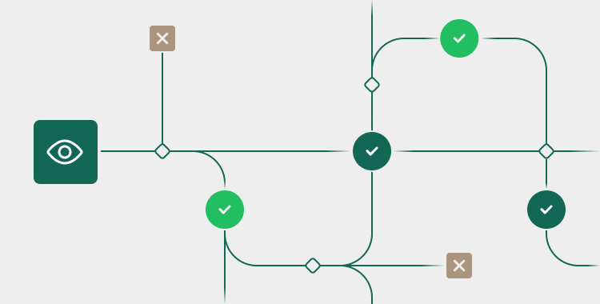

# Testing (v1)

<figure><figcaption></figcaption></figure>

Before you go live, you'll need to test your integration, and the Number team will need to validate it.&#x20;

To help you with that, we've compiled all the information regarding transaction and consent verification, sandbox cards and test data, penny codes, and return codes into this section.

Here are the articles in this section:

<table data-card-size="large" data-view="cards"><thead><tr><th></th><th data-hidden data-card-target data-type="content-ref"></th></tr></thead><tbody><tr><td><strong>Testing Overview ></strong></td><td><a href="testing-overview-v1.md">testing-overview-v1.md</a></td></tr><tr><td><strong>Global Payments Testing ></strong></td><td><a href="global-payments-testing-v1.md">global-payments-testing-v1.md</a></td></tr><tr><td><strong>First Data Testing ></strong></td><td><a href="first-data-testing-v1.md">first-data-testing-v1.md</a></td></tr><tr><td><strong>ACH Testing ></strong></td><td><a href="ach-testing-v1.md">ach-testing-v1.md</a></td></tr></tbody></table>

