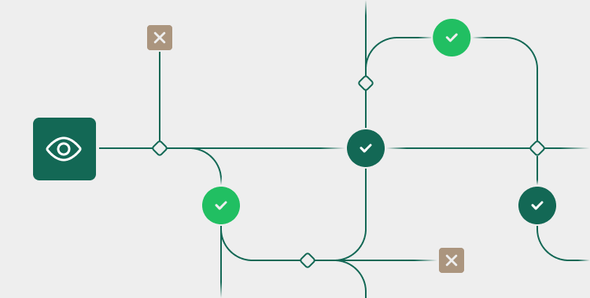

# Testing

<figure><figcaption></figcaption></figure>

Here are the articles in this section:

<table data-card-size="large" data-view="cards"><thead><tr><th></th><th data-hidden data-card-target data-type="content-ref"></th></tr></thead><tbody><tr><td>Testing Overview</td><td><a href="broken-reference">Broken link</a></td></tr><tr><td>Global Payments Testing</td><td><a href="broken-reference">Broken link</a></td></tr><tr><td>First Data Testing</td><td><a href="broken-reference">Broken link</a></td></tr><tr><td>ACH Testing</td><td><a href="broken-reference">Broken link</a></td></tr></tbody></table>

***

### Headline 

