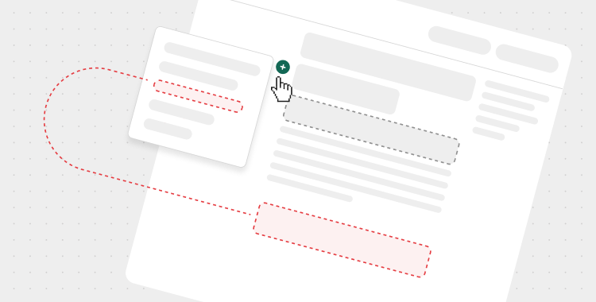

# Dev Portal Guidelines

### Introduction

<figure><figcaption></figcaption></figure>

The [Broken link](broken-reference "mention") are dedicated to the content administrator of the Developer Portal documentation. The group should be marked as a "Hidden Group" and never be published as it's not relevant for Number integrators.


**Any new content added to this website must comply with the policies described** \
**in this group.**



If it is necessary to add elements not described in the guidelines, solutions generally accepted as modern and useful should be used.


<table data-card-size="large" data-view="cards"><thead><tr><th></th><th></th><th data-hidden data-card-cover data-type="files"></th><th data-hidden data-card-target data-type="content-ref"></th></tr></thead><tbody><tr><td>Developer Portal Structure ></td><td></td><td><a href="../../.gitbook/assets/Portal structure.png">Portal structure.png</a></td><td><a href="./">.</a></td></tr><tr><td>Content Guidelines ></td><td></td><td><a href="../../.gitbook/assets/Content guideline.png">Content guideline.png</a></td><td><a href="content-guidelines.md">content-guidelines.md</a></td></tr></tbody></table>

