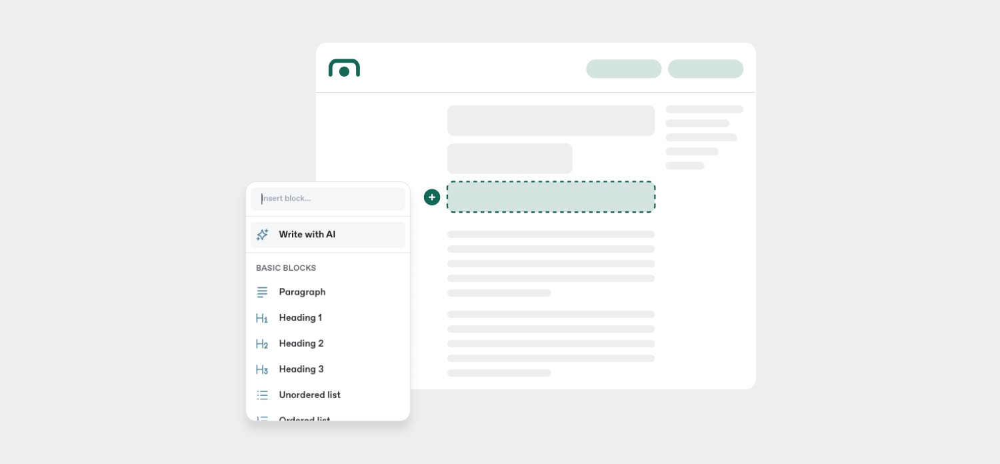

# Component Guidelines

## Typography

The font family selected in GitBook settings to create this page is **Inter** - a modern font that can also be used on other Number pages and materials.

> The administrator cannot manipulate the size and style of individual fonts.

<figure><figcaption></figcaption></figure>

### Font size

**To build page content, we recommend using the following font types available in GitBook:**



Heading 1

It is recommended on subpages consisting of nested subsections - only H1 and H2 text appears in the table of contents on the right.



**Heading 2**

It should be used in place of H1 on subpages where one level of category will be sufficient. Otherwise, use it to create subsections within H1.



**Heading 3**

Use it to create subsections within H2.



**Paragraph bold**

Recommended for lowest-level subsection titles and parts of paragraphs that should be highlighted. **When creating longer paragraphs, highlighting using bold font can also help break up the sentences.**


**When creating danger-level hints, use the bold font and keep the text brief.**




**Paragraph regular**

It should be used in paragraph text and as the main content of other available components (e.g. hints, ordered / unordered lists, cards, etc.).




H1, H2, H3, and the paragraph all create a different type of spacing and may appear differently from the editor on the finished website.


### Text formatting

There are a couple text formatting options available in GitBook:



**Bold text**

Use bold text to **highlight text in paragraphs** and **break up sentences in longer paragraphs**.



**Italic text**

Italics should only be used for quotations and pointing our navigation elements. **Alternatively, you can use quotation marks.**&#x20;

Example: You need to press _Run as administrator_ to install the service.


**Do not use italics or quotations to highlight. Depending on context, they can be confused for sarcasm when not used for the purpose of quotation.**&#x20;

**Use bold text or hint components to highlight key text.**




**Code text**

When using names of variables or parameters, files, or just adding a bit of code, use the code highlighting.

Example: Use the `SessKey` as a header to authenticate.



**Strikethrough**

Not used. You can consider using strikethrough for corrections, but you can also version your documentation using GitBook if you want to keep the older text available for the users.



#### Colored text and background

Green text can be used to highlight a link formatted as code. This will make them more similar to other links that appear in a tint of the primary color. Otherwise not used, but can be an alternative method of highlighting.



**Annotations**

Annotations allow you to add more context when the user hovers over some text. Use sparringly when you want to save some space to explain a lot of values or if you want to add dictionary-like descriptions to language that belongs to the business domain.



### Text casing

Only main navigation items in the navigation column on the left should use Title Case. Navigation groups should use UPPERCASE. **All headers and page content should use regular text casing.**

***

## Spaces and dividers

<figure><figcaption></figcaption></figure>

To make the page content more readable, it is recommended to use an empty row of paragraph text as an additional spacer between the sections.

**Follow the recommendations for the spaces between the specific sections:**&#x20;

* **End of page**\
  \- Empty paragraph row x2
* **Main site sections**\
  \- Empty paragraph row + divider + empty paragraph row
* **2nd level sections**\
  \- An empty paragraph row
* **3rd level sections**\
  \- No empty rows or dividers, just use the spacing created by H3.
* **Parameter descriptions**\
  \- Add dividers on both sides
* **Content-rich subpage**\
  \- Make sure to correctly use the headings and rules above to divide the content as it should be enough. Only make exceptions in the rarest of cases.

***

## Components

### Available components

To create this page, we used most of the components available in GitBook. Below are some recommendations for their use in future iterations of the documentation.


It is recommended to use different types of content styles - the aim is to increase the readability of the information provided.


You can find all available components by clicking on "+" icon next to each main content section type. You may also enter a new line by pressing "Enter" and hit forward slash "/" to get the same options.

<figure><figcaption></figcaption></figure>

We highly recommend mixing the content by adding:

#### Lists

* **Stepper:**\
  A component that is ideally suited to describe a process with steps that logically follow each other or a more complex list with longer descriptions. This component can also be used to differentiate the look of content.
* **Unordered list:**\
  For all other bullet point style elements that do not form logical steps/points.
* **Ordered lists:**\
  A minimalistic version of the stepper for when you need to form logical steps or need to assign numbers to each option, but do not have that much content to add in the list.
* **Task lists:**\
  A list of checkboxes added to allow the user to mark the completion of individual necessary tasks.

#### Hints

We can use 4 types of hints: info, success, warning, and danger. **Hints should always have all of the necessary context to understand them and not depend on the adjecent content.** Avoid using words like "this" to begin a hint and instead fully clarify the object of the hint.


Info hint is used to highlight informative content with a neutral message and to increase content readability. Most commonly used hint.

Example: "With the Verifone Windows event log installed, a merchant can export the log and send it to Number if any unexpected behavior is encountered."



Success hint is used to highlight content with a positive message such as special features that can be optionally enabled.

Example: "You can also use our **custom desktop application** as an alternative to the Virtual Terminal. The desktop application supports much of the same features."



Warning hint is use to bring attention to potential issues and things to look out for, and provide solutions for those scenarios.

Example: "If your customer wants to change the schedule completely, it is recommended that you cancel the existing consent and create a new one."



**Danger hint is use to highlight information necessary to achieve a goal and avoid problems, or examples of errors.**&#x20;

**Example: "Never request a query without a limiting date factor. As the account grows, you may attempt to return an excessive number of past records and cause an error."**


#### Quotes

> Quotes can be used to quote text from another website or, in rare circumstances, to help highlight some content and to separate it from a larger part.

#### File and URL embeddings

For additional files, documents and any other types of materials that we want to make available to users, please use the "Files" component - it allows you to highlight files for download.

This will force you to upload the file to GitBook - if you absolutely need a link to a file that is supposed to change overtime and you do not plan on versioning, you can use "Embed a URL" component instead.

You should also use the "Embed a URL" component to link to external websites or use "Cards" when there are multiple options for the same thing.


**Files to download should be placed in at least two places:**

* **Next to the documentation fragment they supplement**
* **In the** [tools-and-downloads.md](../../documentation/resources/tools-and-downloads.md "mention") **section in** [resources](../../documentation/resources/ "mention")

**The same is true for links to various tools and examples**


#### Tables

A table is a readable component that can be used for various purposes:

* As a standard table consisting of multiple related content&#x20;
* As a bullet point element consisting of a graphic and content (e.g. presentation of the test credit cards numbers of specific card brands)


**Warning**

For a tables with a lot of content, we recommend using a standard content width with an internal, horizontal scroll inside the table.


**Examples:**

*   Bullet points table:\

    <table data-full-width="false"><thead><tr><th width="134"></th><th width="146">Card brand</th><th width="468">Card number</th></tr></thead><tbody><tr><td></td><td><strong>PIN Debit</strong></td><td><strong>4017 7799 9111 3335</strong></td></tr><tr><td></td><td><strong>Visa</strong></td><td><strong>4761 5300 0111 1118</strong></td></tr><tr><td></td><td><strong>MasterCard</strong></td><td><strong>5137 2211 1111 6668</strong></td></tr></tbody></table>
*   Content-heavy table with internal horizontal scroll:\

    <table data-full-width="false"><thead><tr><th width="134">Card brand</th><th width="201">Card number</th><th width="104">EXP date</th><th width="82">CVV</th><th width="513">Track data</th></tr></thead><tbody><tr><td></td><td>4012 8818 8881 8888</td><td>12/28</td><td>999</td><td>%B4012881888818888^TSYS PAYMENT^25121011796251900000?;4012881888818888=25121011796251900000?</td></tr><tr><td></td><td>5146 3150 0000 0055</td><td>12/28</td><td>998</td><td>%B5146315000000055^TSYS PAYMENT^251210100000?;5146315000000055=251210100000?</td></tr><tr><td></td><td>3714 4963 5392 376</td><td>12/28</td><td>9997</td><td>%B371449635392376^TSYS PAYMENT^251210100000?;371449635392376=251210100000?</td></tr></tbody></table>

#### Cards

A component that can replace a bullet list and can be used in many variants to improve content readability:

* 2 columns
* 3 columns&#x20;
* With full card image
* With content image&#x20;
* With redirect on click

Example: Credit card (3 columns, full card image):

<table data-view="cards"><thead><tr><th data-card-cover data-type="files"></th></tr></thead><tbody><tr><td><a href="../../.gitbook/assets/Masercard.png">Masercard.png</a></td></tr><tr><td><a href="../../.gitbook/assets/Visa.png">Visa.png</a></td></tr><tr><td><a href="../../.gitbook/assets/Amex.png">Amex.png</a></td></tr></tbody></table>

#### Tabs

A component that can be used to condense equivalent or similar content consisting by placing it in individual tabs.&#x20;

We highly recommend using it for multiple code blocks with different technology presentations:

#### Code blocks and multi-syntax code blocks

The code block component is used to show code with syntax highlighting. Depending on the situation, you might want to add a file name, text wrapping, or line numbers.&#x20;

The multi-syntax code block is just short for adding the tab component with code blocks inside.


You can use code blocks for any values that the user might need to copy like encrypted test card numbers. Each code block comes with a copy button.



For text that doesn't have a supported syntax highlighting, use the next closest thing.

For console commands, use **Ruby**, and for Number's query language, use **SQL**.



**Try to format your sample code to fit each line of code without wrapping, and enable line wrapping for the rest.**&#x20;

**For longer code, always enable line numbering to make it easier to read the code and reference specific lines of code.**


Example:

### API specification components

#### REST API

Use the OpenAPI block and update the `master-openapi-rest.yaml` file with your specification. GitBook will create REST API specification blocks based on the specification you provide in an OpenAPI format.&#x20;


Guide to OpenAPI with GitBook



OpenAPI specification



master-openapi-rest.yaml file


To make changes, you can try placing a new OpenAPI component to change the "Source" and replace it with an updated version of this file. You can also try updating the file in the _Documentation-Site_ repo and it should sync back to GitBook.


Use OpenAPI components to create reusable parameters and schema. This will allow you to propagate changes like an updated description easily across all relevant endpoints.



When working on API reference, even when something feels self-explanatory, always try to describe each request and response parameter and give meaningful examples.


#### SOAP API

Since OpenAPI standard is not ideal for representing SOAP APIs, they use a more granular approach. Unfortunately it requires a lot of work upfront, but then becomes easier to maintain when used in conjunction with [#reusable-components](component-guidelines.md#reusable-components "mention").

<figure><figcaption>
Example SOAP API reference
</figcaption></figure>

Add a header with the name of your method, then describe the type and address, add a paragraph with a description, and two tabs with the request body and response body. You can optionally follow it up with a code block containing a sample XML response.

Request body and response body describe their parameters by using their name, type, providing a description when available, an example in a separate line, and a list of values for enums. Complex objects also list off the fields inside them and link to the [soap-object-dictionary.md](../../api-reference/soap-api/soap-object-dictionary.md "mention") where those are broken down in the same way. **Each parameter should be delimited by dividers and the tab borders**.

### Reusable components

To make it easier to propagate changes across the documentation, instead of manually duplicating the content by copy-pasting it, **it's recommended to use the "Turn into reusable component" feature**.


Making change to a reusable component in one place will propagate it to all instances of the reusable component.



When hovering over a component, you can expand its options to turn it into a reusable component.&#x20;

When you create a reusable component, you can expand it into more lines by pressing enter and add new or existing components into it.

When you press Ctrl+Enter on the last line of a component, you can force yourself out of a component, and out of reusable component scope instead of expanding them.



It's not possible to nest reusable components within each other or to create a reusable component that's meant to be nested within a normal component (e.g. paragraph inside of a paragraph).



**If you attempt to create a reusable component within tabs, it will delete the entire tab.**&#x20;

**After you do that, click off somewhere else and Ctrl+Z to revert the tab deletion. The reusable component will still be saved to your list with a default name.**


You can read more about reusable components here:&#x20;



#### Removing reusable components

When you hover over a reusable component, you can expand options to rename, detach, or delete.

* Renaming will allow you to change the name of the component.
* Detatching a reusable component instance will unsync it with the reusable component, making it possible to make changes without propagating them.
* Deleting a reusable component instance will remove that instance from the selected place.

<figure><figcaption></figcaption></figure>

#### Naming reusable components

**When naming reusable components, always follow this template:** \
`<type of component> - <short descriptive name>`

#### Reusable component types

Here are the reusable component type names you should use and when:



**param**

Use when describing a single API request or response parameter (name, type, description, example, enum values). Example:



**params**

Use when grouping descriptive components for parameters used often together into one reusable component. Example:



info / warning / danger

Use when creating a reusable hint of specific type. Examples:



**link**

Use when creating a reusable URL embedding or file download tiles. Examples:



code

Use when creating a reusable code block component. Example:



#### block

Use when creating a reusable component that consists of text and, optionally, of other components. You can use it for other complex components. Examples:



