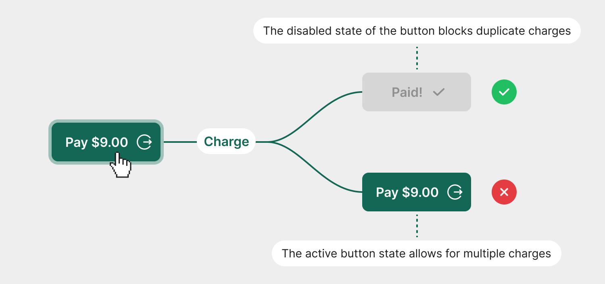

# Content Guidelines

## Typography

The font family selected in Gitbook settings to create this page is **Inter** - a modern font that can also be used on other Number pages and materials.

> The administrator cannot manipulate the size and style of individual fonts.

<figure><figcaption></figcaption></figure>

**To build page content, we recommend using the following font types available in GitBook:**



#### Heading 1


Font style is visible in the **Table of Contents** section.


It is recommended to skip this font size on subpages where it is not necessary (it is too large).&#x20;

It is allowed to be used on subpages consisting of a large number of sections and subsections - to which the user should have easy access.



#### Heading 2


Font style is visible in the **Table of Contents** section.


It should be used in place of H1 on subpages where one level of category visible in the Table of Contents section will be sufficient.\




#### Heading 3

Recommended for subsections titles.&#x20;



#### Paragraph Bold

Recommended for lower-level subsection titles and parts of paragraphs that should be highlighted.



#### Paragraph Regular

It should be used in paragraph text and as the main content of other available components (e.g. hints, ordered / unordered lists, cards, etc.).





**Exceptions to the use of specific font types:**

To improve the readability of the content, it is allowed to use fonts in the sizes H2, and H3 in the component headings (e.g. hint, ordered / unordered lists, cards, etc.) - they will not appear as Table of Contents categories.


***

## Spaces and dividers

<figure><figcaption></figcaption></figure>

To make the page content more readable, it is recommended to use an empty row of paragraph text as an additional spacer between the sections.

It is recommended to follow the recommendations for the spaces between the specific sections:&#x20;

* **Main site sections**\
  \- Empty paragraph row + Divider + Empty paragraph row
* **Repetitive sections appearing next to each other**\
  \- Divider or empty paragraph row
* **Content-rich subpage**\
  \- Divider or empty paragraph row

***

## Recommendations for the use of components

To create this page, we used most of the components available in GitBook. Below are some recommendations for their use in future iterations of the documentation.


It is recommended to use different types of content styles - the aim is to increase the readability of the information provided.


You can find all available components by clicking on "+" icon next to each main content section type:

<figure><figcaption></figcaption></figure>

We highly recommend mixing the content by adding:

### Lists

* **Unordered list:**\
  For all bullet point style elements that do not form logical steps/points
* **Ordered lists:**\
  A logical list of steps to be performed or a point-by-point presentation of some process.
* **Task lists:**\
  A list of checkboxes added to allow the user to mark the completion of individual necessary tasks.
* **Stepper:**\
  A component that is ideally suited to describe a more complex process with steps that logically follow each other.\
  \
  **Note:** this component can also be used to differentiate the look of content even if the content it contains is not a logical list (we can use it as a bullet point list)

***

### Hints

We can use 4 types of hints:


**Regular hint**

Use to highlight content with a neutral message and to increase content readability.



**Success hint**

Use to highlight content with a neutral message and to increase content readability.



**Warning hint**

Use to highlight warning content.



**Error hint**

Use to highlight important content, information necessary to achieve a goal, or examples of errors.


***

### Quote

> This component can be used to highlight some content - or to separate it from a larger part in order to differentiate the appearance of the content.

***

### Files

For additional files, documents and any other types of materials that we want to make available to users, please use the "Files" section - it allows you to highlight files for download.


**Important**

Files to download should be placed in at least two places:

* Next to the documentation fragment they supplement
* In the "Resoruces --> Tools and Downloads" section


***

### Tables

A table is a readable component that can be used for various purposes:

* As a standard table consisting of multiple related content&#x20;
* As an bullet point element consisting of a graphic and content  (e.g. presentation of the test credit cards numbers of specific suppliers)


**Warning**

For a tables with a lot of content, we recommend using a standard content width with an internal, horizontal scroll inside the table.


**Examples:**

*   Bullet points table:\

    <table data-full-width="false"><thead><tr><th width="134">Card Brand</th><th width="146">Card Brand</th><th width="468">Card Number</th></tr></thead><tbody><tr><td></td><td><strong>PIN Debit</strong></td><td><strong>4017 7799 9111 3335</strong></td></tr><tr><td></td><td><strong>Visa</strong></td><td><strong>4761 5300 0111 1118</strong></td></tr><tr><td></td><td><strong>MasterCard</strong></td><td><strong>5137 2211 1111 6668</strong></td></tr></tbody></table>
*   Content-heavy table with internal horizontal scroll:\

    <table data-full-width="false"><thead><tr><th width="134">Card Brand</th><th width="201">Card Number</th><th width="104">EXP Date</th><th width="82">CVV</th><th width="513">Track Data</th></tr></thead><tbody><tr><td></td><td>4012 8818 8881 8888</td><td>12/28</td><td>999</td><td>%B4012881888818888^TSYS PAYMENT^25121011796251900000?;4012881888818888=25121011796251900000?</td></tr><tr><td></td><td>5146 3150 0000 0055</td><td>12/28</td><td>998</td><td>%B5146315000000055^TSYS PAYMENT^251210100000?;5146315000000055=251210100000?</td></tr><tr><td></td><td>3714 4963 5392 376</td><td>12/28</td><td>9997</td><td>%B371449635392376^TSYS PAYMENT^251210100000?;371449635392376=251210100000?</td></tr></tbody></table>

***

### Cards

A component that can replace a bullet list and can be used in many variants to improve content readability:

* 2 columns
* 3 columns&#x20;
* With full card image
* With content image&#x20;

We especially recommend using it to submit credit card details.

**Examples:**

*   Credit card details cards (2 columns):

    <table data-card-size="large" data-view="cards"><thead><tr><th></th><th></th></tr></thead><tbody><tr><td><h3></h3></td><td><strong>DS: 6011 0009 9302 6909</strong> <strong>EXP DATE: 01/28</strong> <strong>CVV: 999</strong>  Enter the following amount ($10.10) should get partial approval for ($10.00)</td></tr><tr><td><h3></h3></td><td>
<strong>MC: 5146 3126 2000 0045</strong> <strong>EXP DATE: 01/28</strong>

<strong>CVV: 998</strong>  Enter the following amount ($11.10) should get partial approval for ($5.55)
</td></tr></tbody></table>

*   Featured bullet point list (3 columns):\

    <table data-view="cards"><thead><tr><th></th><th></th></tr></thead><tbody><tr><td><strong>Bullet point 1</strong></td><td>Bullet point 1 content for few lines</td></tr><tr><td><strong>Bullet point 2</strong></td><td>Bullet point 2 content for few lines</td></tr><tr><td><strong>Bullet point 3</strong></td><td>Bullet point 1 content for few lines</td></tr></tbody></table>

***

### Tabs

