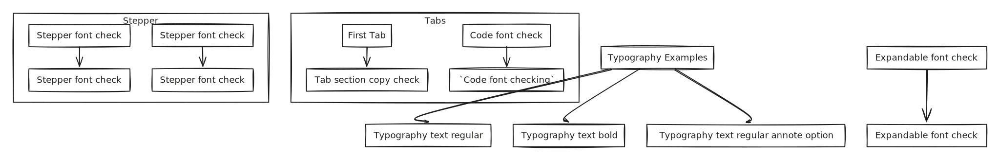

# Typography and components checkin

## Color test


This is a hint color test



This is a hint color test



This is a hint color test



This is a hint color test


***

## This is a Gitbook typography style check section:

### Heading 2

#### Heading 3

Paragraph text Regular

**Paragraph text Bold**

* Unordered list copy check Regular
* **Unordered list copy check Bold**


1. Ordered list copy check Regular
2. **Ordered list copy check Bold**

Task list:

* [ ] Task list copy check Regular
* [ ] **Task list copy check Bold**


Hint copy check Regular

The content below the Headline



**Hint copy check Bold**

**The content below the Headline**



Hint copy check Regular

The content below the Headline



**Hint copy check Bold**

**The content below the Headline**


> Quote copy check

```
// Code block copy check
```

<table><thead><tr><th>Table headline copy check</th><th data-type="users" data-multiple></th><th data-type="files"></th><th data-type="content-ref"></th></tr></thead><tbody><tr><td>Table content copy check</td><td><a href="https://app.gitbook.com/u/maHyx1v6IxSzNsilReZKEgNzyZm1">Dawid Leszczyński</a></td><td><a href="../.gitbook/assets/End to end encyption.png">End to end encyption.png</a></td><td><a href="../">..</a></td></tr><tr><td>Table content copy check</td><td><a href="https://app.gitbook.com/u/u3nr0OrwmKXkjStLcthkida1rOm2">Mariusz Karłuk</a></td><td><a href="../.gitbook/assets/Verifone.png">Verifone.png</a></td><td><a href="broken-reference">Broken link</a></td></tr><tr><td>Table content copy check</td><td></td><td></td><td><a href="../documentation/testing/">testing</a></td></tr></tbody></table>

<table data-view="cards"><thead><tr><th></th></tr></thead><tbody><tr><td>Typography text regular</td></tr><tr><td><strong>Typography text bold</strong></td></tr><tr><td><a data-footnote-ref href="#user-content-fn-1">Typography text regular annote option</a></td></tr></tbody></table>

<table data-card-size="large" data-view="cards"><thead><tr><th></th></tr></thead><tbody><tr><td>Typography text regular</td></tr><tr><td><a href="typography-and-components-checkin.md#rest-api">Typography text regular</a> - link</td></tr></tbody></table>



Tab section copy check



## `Code font checking`

### `Code font checking`

#### `Code font checking`

`Code font checking`



<details>

<summary>Expandable font check</summary>

Expandable font check

</details>



## Stepper font check

### Stepper font check

#### Stepper font check

Stepper font check



## Stepper font check

Stepper font check





## Math component font style:

$$
f(x) = x * e^{2 pi i \xi x}
$$


[master-openapi-rest.yaml](../.gitbook/assets/master-openapi-rest.yaml)



[..](../)


[^1]: Annotate option: This is a copy and component test
